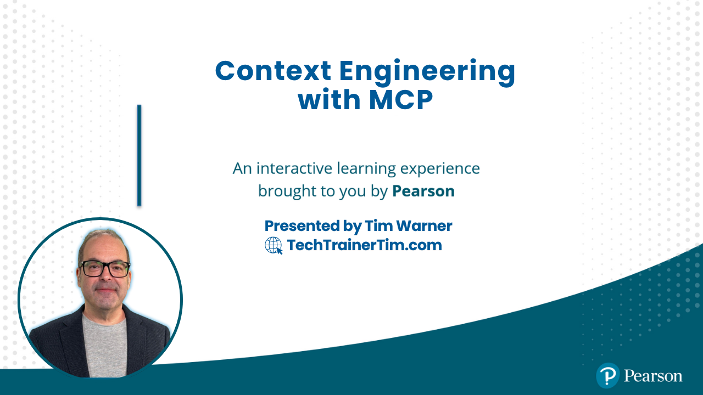

# Context Engineering with MCP: From Prompts to Persistent AI Memory



Welcome to the training hub for mastering **Context Engineering with Model Context Protocol (MCP)**. Whether you're building AI applications or deepening your understanding of persistent AI memory, this guide provides everything you need to implement production-ready context systems.

👉 **New to this repo?** Check out the [Getting Started Guide](GETTING-STARTED.md) for navigation help!
📋 **Looking for the course plan?** View the [Context Engineering Course Plan](course-plan.md)!

[](https://github.com/timothywarner-org/coretext-mcp/actions)

*Last updated: January 29, 2025*

---

## 📬 **Contact Information**

- **[Website](https://techtrainertim.com)**
- **[GitHub](https://github.com/timothywarner)**
- **[LinkedIn](https://www.linkedin.com/in/timothywarner/)**
- **[YouTube Channel](https://www.youtube.com/channel/UCim7PFtynyPuzMHtbNyYOXA)**
- **[Bluesky](https://bsky.app/profile/techtrainertim.bsky.social)**
- **[Mastodon](https://mastodon.social/@techtrainertim)**

---

## 📆 **Course Plan Overview**

This hands-on course is structured into 4 segments, each approximately 50 minutes:

1. **Understanding Context - Why Your AI Has Amnesia (50 min)**
   - Token budgets, context windows, and tokenization fundamentals
   - Live demo: ChatGPT vs Claude with MCP
   - Hands-on with Claude Desktop and VS Code GitHub Copilot
   - Configure your first MCP server for persistent context

2. **Building Local MCP Servers - Your First Context System (50 min)**
   - Build production-ready MCP servers with TypeScript/Python SDK
   - Implement tools, resources, and prompts for AI discovery
   - Test with MCP Inspector browser tool
   - Create GitHub repository integration for long-term memory

3. **Azure Deployment - From Local to Cloud-Scale Memory (50 min)**
   - Deploy MCP servers to Azure App Service
   - Configure authentication, secrets, and Key Vault integration
   - Implement persistent storage with Azure Cosmos DB
   - Monitor with Application Insights and logging

4. **Advanced Patterns - Multi-Agent Memory Architectures (50 min)**
   - Design episodic, semantic, and working memory systems
   - Implement vector search with Azure AI Search
   - Build multi-agent orchestration across ChatGPT, Claude, and Copilot
   - Production considerations: security, scale, and cost optimization

💡 **See the full [detailed course plan](course-plan.md) for complete information!**

---

## 🎯 **Course Overview**

**Level:** Intermediate
**Duration:** 4 hours (4 × 50-minute segments)
**Format:** Hands-on live training

### What You'll Build

You mastered prompting—now stop your AI from forgetting everything. This hands-on course teaches you **Context Engineering** using MCP—the production-ready protocol adopted by Microsoft and Anthropic. You'll build persistent AI memory using MCP servers, Azure AI Service, GitHub, and VS Code, eliminating tedious context resets forever.

**By the end of this course, you will have:**
- ✅ Built a working MCP server that gives AI access to your GitHub repositories
- ✅ Deployed production MCP infrastructure to Azure with authentication and monitoring
- ✅ Implemented multi-agent memory systems that persist across sessions
- ✅ Configured Claude Desktop, VS Code Copilot, and ChatGPT with persistent context

Leave with working code, templates, and the exact memory patterns the leading companies use today.

### Audience Profile

As a context engineer, you implement, manage, and optimize AI memory systems that enable agents to maintain state across sessions. You build MCP servers that expose tools, resources, and persistent context to AI platforms including Claude, ChatGPT, and GitHub Copilot.

#### This course is for you if you

- Use ChatGPT Plus/Team, Claude Pro, or GitHub Copilot in your daily work
- Need AI tools that retain context reliably across sessions and workflows
- Want practical, Azure-integrated solutions for context persistence
- Seek to master MCP early to lead adoption in your enterprise
- Are tired of copy-pasting the same context into every conversation

#### Required experience

- Active experience with at least one AI assistant (ChatGPT, Claude, or Copilot)
- Comfortable with GitHub repos, commits, and basic Git workflows
- Basic understanding of Azure services or willingness to create free account
- Programming experience in JavaScript/TypeScript or Python
- Command-line basics: can run npm/pip commands and navigate directories

---

## 🚀 **The Good Stuff: Must-Have MCP Resources**

Essential links for mastering Model Context Protocol:

- [MCP Official Specification](https://spec.modelcontextprotocol.io/)
- [MCP Documentation Hub](https://modelcontextprotocol.io/docs)
- [Course Repository](https://github.com/timothywarner-org/context-engineering)
- [TypeScript SDK Documentation](https://github.com/modelcontextprotocol/typescript-sdk)
- [Python SDK Documentation](https://github.com/modelcontextprotocol/python-sdk)
- [MCP Inspector Tool](https://github.com/modelcontextprotocol/inspector)
- [Claude Desktop Setup Guide](https://modelcontextprotocol.io/docs/quickstart/user)

---

## 📚 **MCP Learning Paths**

Structured resources to master all course skills:

### Official Documentation

- [MCP Protocol Overview](https://modelcontextprotocol.io/docs/concepts/overview)
- [MCP Architecture Guide](https://modelcontextprotocol.io/docs/concepts/architecture)
- [Building MCP Servers](https://modelcontextprotocol.io/docs/building-servers/introduction)
- [MCP Client Integration](https://modelcontextprotocol.io/docs/building-clients/introduction)
- [Security Best Practices](https://modelcontextprotocol.io/docs/concepts/security)

### AI Platform Integration

- [Claude Desktop MCP Configuration](https://modelcontextprotocol.io/docs/quickstart/user)
- [VS Code GitHub Copilot Extensions](https://code.visualstudio.com/docs/copilot/overview)
- [ChatGPT Custom GPTs and Actions](https://platform.openai.com/docs/actions)
- [Azure OpenAI Service](https://learn.microsoft.com/en-us/azure/ai-services/openai/)

---

## 🛡️ **Context Engineering Best Practices**

Expert guidance for implementing robust AI memory systems:

### Memory Architecture Patterns

- [Episodic Memory Systems](https://en.wikipedia.org/wiki/Episodic_memory) - Time-ordered conversation storage
- [Semantic Memory Systems](https://en.wikipedia.org/wiki/Semantic_memory) - Knowledge and facts storage
- [Working Memory](https://en.wikipedia.org/wiki/Working_memory) - Active task context management
- [Vector Databases for AI](https://learn.microsoft.com/en-us/azure/search/vector-search-overview)

### Azure Integration

- [Azure App Service](https://learn.microsoft.com/en-us/azure/app-service/) - Host MCP servers
- [Azure Key Vault](https://learn.microsoft.com/en-us/azure/key-vault/) - Secure secrets management
- [Azure Cosmos DB](https://learn.microsoft.com/en-us/azure/cosmos-db/) - Globally distributed database
- [Azure AI Search](https://learn.microsoft.com/en-us/azure/search/) - Vector search capabilities
- [Application Insights](https://learn.microsoft.com/en-us/azure/azure-monitor/app/app-insights-overview) - Monitoring and diagnostics

### Context Optimization

- [Token Counting and Management](https://platform.openai.com/tokenizer)
- [Prompt Engineering Guide](https://www.promptingguide.ai/)
- [RAG (Retrieval Augmented Generation)](https://learn.microsoft.com/en-us/azure/search/retrieval-augmented-generation-overview)
- [Context Compression Techniques](https://arxiv.org/abs/2310.06201)

---

## 🔧 **Your Toolkit**

Essential tools to follow along and practice efficiently:

### Required Setup

**GitHub Account**
- Ability to create repositories
- Generate personal access tokens
- Fork and clone repositories

**AI Platform Access**
- [Claude Desktop](https://claude.ai/download) (Windows/Mac) - Native MCP support
- [VS Code](https://code.visualstudio.com/) with [GitHub Copilot](https://marketplace.visualstudio.com/items?itemName=GitHub.copilot)
- [ChatGPT Plus or Team](https://openai.com/chatgpt/pricing/) (optional for multi-agent)

**Development Environment**
- [Node.js 20 LTS](https://nodejs.org/) or [Python 3.10+](https://www.python.org/downloads/)
- [Git](https://git-scm.com/downloads)
- [Azure CLI](https://learn.microsoft.com/en-us/cli/azure/install-azure-cli)
- [Azure account](https://azure.microsoft.com/en-us/free/) (free tier available)

### VS Code Extensions

- [MCP Tools](https://marketplace.visualstudio.com/search?term=mcp&target=VSCode)
- [Azure Account](https://marketplace.visualstudio.com/items?itemName=ms-vscode.azure-account)
- [Azure App Service](https://marketplace.visualstudio.com/items?itemName=ms-azuretools.vscode-azureappservice)
- [REST Client](https://marketplace.visualstudio.com/items?itemName=humao.rest-client)

### MCP Development Tools

```bash
# Install MCP Inspector globally
npm install -g @modelcontextprotocol/inspector

# Install TypeScript SDK
npm install @modelcontextprotocol/sdk

# Install Python SDK
pip install mcp-sdk
```

### Azure PowerShell/CLI

```bash
# Install Azure CLI
# Windows: winget install Microsoft.AzureCLI
# Mac: brew install azure-cli

# Install Azure PowerShell module
Install-Module -Name Az -Scope CurrentUser -Repository PSGallery -Force
```

---

## 💻 **Hands-on Labs & Practice**

Learn through hands-on experience:

### Course Repository Structure

```
context-engineering/
├── labs/                 # Hands-on lab exercises
│   ├── lab01-context/   # Understanding context and tokenization
│   ├── lab02-local/     # Building local MCP servers
│   ├── lab03-azure/     # Azure deployment
│   └── lab04-advanced/  # Multi-agent architectures
├── examples/            # Working code examples
│   ├── filesystem/      # Basic file access server
│   ├── github/          # GitHub integration
│   ├── database/        # Database query tools
│   └── memory/          # Memory persistence patterns
├── deploy/              # Azure deployment templates
│   ├── bicep/          # Infrastructure as Code
│   └── scripts/        # Deployment automation
└── docs/               # Additional documentation
```

### Getting Started

Clone the repository and set up your environment:

```bash
git clone https://github.com/timothywarner-org/context-engineering.git
cd context-engineering
npm install
```

### Lab Setup Guide

Detailed setup instructions are available in [labs/LAB-SETUP.md](labs/LAB-SETUP.md)

### Practice Resources

- [MCP Server Examples](https://github.com/modelcontextprotocol/servers) - Official example servers
- [Azure Free Account](https://azure.microsoft.com/en-us/free/) - $200 credit for 30 days
- [GitHub Education Pack](https://education.github.com/pack) - Free Azure credits for students
- [Microsoft Learn Sandbox](https://learn.microsoft.com/en-us/training/) - Free practice environments

---

## 📖 **Recommended Preparation**

### Before the Course

**Essential Reading:**
- [MCP Specification](https://spec.modelcontextprotocol.io/) - Official protocol documentation (30 min)
- [MCP Quickstart Guide](https://modelcontextprotocol.io/docs/quickstart/user) - Basic setup (15 min)

**Recommended Videos:**
- *How LLMs Understand & Generate Human Language* by Kate Harwood (O'Reilly)
- *Introduction to Azure AI Services* (Microsoft Learn)

**Optional Books:**
- *Quick Start Guide to Large Language Models* by Sinan Ozdemir
- *AI for Everyone: A Beginner's Handbook for Artificial Intelligence* by Pearson

### Recommended Follow-up

**Advanced Learning:**
- *Generative AI Toolbox* by Shaun Wassell (O'Reilly)
- *Securing Generative AI* by Omar Santos (O'Reilly)
- *Building LLM Applications* (O'Reilly, 2024)

**Related Topics:**
- Vector databases and embeddings
- Prompt engineering advanced techniques
- Multi-agent orchestration patterns
- Production AI system architecture

---

## 📅 **Detailed Schedule**

*Each segment is 50 minutes with 10-minute breaks between segments. Total duration: 4 hours.*

### Segment 1: Understanding Context - Why Your AI Has Amnesia (50 minutes)

**Learning Objectives:**
- Understand token budgets and context windows in modern LLMs
- Experience context loss firsthand in ChatGPT vs. context persistence in Claude
- Learn how MCP solves the context problem architecturally
- Use MCP in Claude Desktop and VS Code GitHub Copilot

**Topics Covered:**
- The anatomy of context loss: tokens, windows, and limitations
- Live demo: Watch ChatGPT forget, Claude remember - the MCP difference
- Introduction to Model Context Protocol: architecture and capabilities
- Hands-on: Configure Claude Desktop with your first MCP server
- Using MCP with GitHub Copilot in VS Code

**Exercise:** Configure Claude Desktop to use the filesystem MCP server and maintain context across conversations (10 min)

**Key Takeaways:**
- Context windows are measured in tokens (words ≈ 1.3 tokens)
- Copy-paste workflows don't scale for professional development
- MCP provides tools, resources, prompts, and sampling capabilities
- Claude Desktop has native MCP support today

---

### Segment 2: Building Local MCP Servers - Your First Context System (50 minutes)

**Learning Objectives:**
- Build a working MCP server using the official TypeScript SDK
- Implement tools that AI can discover and invoke
- Create resources for AI to access persistent data
- Test your MCP server with MCP Inspector and Claude Desktop

**Topics Covered:**
- MCP server architecture: tools, resources, prompts, and sampling
- Setting up the TypeScript SDK project structure
- Implementing your first tool: GitHub repository access
- Creating resources: files, URLs, and dynamic content
- Testing with MCP Inspector browser tool

**Live Coding:**
```typescript
// Build an MCP server that gives Claude access to GitHub repos
import { Server } from '@modelcontextprotocol/sdk/server/index.js';
import { StdioServerTransport } from '@modelcontextprotocol/sdk/server/stdio.js';

const server = new Server({
  name: 'github-context-server',
  version: '1.0.0'
}, {
  capabilities: {
    tools: {},
    resources: {}
  }
});

// Implement tools for repo access, file reading, commit history
server.setRequestHandler(ListToolsRequestSchema, async () => ({
  tools: [
    {
      name: 'read_repo_file',
      description: 'Read a file from a GitHub repository',
      inputSchema: {
        type: 'object',
        properties: {
          repo: { type: 'string' },
          path: { type: 'string' }
        }
      }
    }
  ]
}));
```

**Exercise:** Extend the GitHub MCP server to access your own repository and read specific files (10 min)

**Key Takeaways:**
- MCP servers are simple Node.js/Python applications
- The SDK handles protocol details; you focus on tool logic
- Tools define schemas for AI to understand parameters
- Local testing with Inspector ensures reliability

---

### Segment 3: Azure Deployment - From Local to Cloud-Scale Memory (50 minutes)

**Learning Objectives:**
- Deploy MCP servers to Azure App Service
- Configure authentication and environment variables securely
- Connect Claude Desktop to remote MCP servers
- Implement persistent memory using Azure Storage

**Topics Covered:**
- Azure deployment strategies for MCP servers
- Environment configuration and secrets management
- Authentication: API keys and Azure AD integration
- Persistent storage: Azure Blob, Table Storage, Cosmos DB
- Monitoring and logging with Application Insights

**Live Deployment:**
```bash
# Deploy MCP server to Azure App Service
az webapp up --name coretext-mcp --runtime "NODE:20-lts"

# Configure environment variables
az webapp config appsettings set --name coretext-mcp \
  --settings GITHUB_TOKEN=@Microsoft.KeyVault(...)

# Enable Application Insights
az monitor app-insights component create --app coretext-mcp
```

**Architecture:**
```
Claude Desktop → HTTPS → Azure App Service (MCP Server)
                              ↓
                        Azure Key Vault (secrets)
                              ↓
                        Azure Cosmos DB (memory store)
                              ↓
                        Application Insights (monitoring)
```

**Exercise:** Deploy your GitHub MCP server to Azure and connect Claude Desktop to the remote endpoint (10 min)

**Key Takeaways:**
- Azure App Service provides easy MCP server hosting
- Key Vault keeps secrets secure
- Cosmos DB enables globally distributed memory
- Application Insights provides production observability

---

### Segment 4: Advanced Patterns - Multi-Agent Memory Architectures (50 minutes)

**Learning Objectives:**
- Design memory architectures: episodic, semantic, and working memory
- Implement vector-based semantic search with Azure AI Search
- Orchestrate multiple AI agents sharing context through MCP
- Build a production customer service bot with persistent memory

**Topics Covered:**
- Memory architecture patterns in AI systems
- Vector databases: embeddings and similarity search
- Multi-agent orchestration: ChatGPT ↔ Claude via shared MCP context
- Context compression and pruning strategies
- Cost optimization and caching techniques

**Live Build: Customer Service Bot**
```typescript
// Multi-agent memory system
class CustomerServiceMemory {
  episodic: ConversationHistory[];  // What happened
  semantic: VectorStore;             // What it means
  working: CurrentContext;           // Active task state

  async retrieveRelevantContext(query: string) {
    // 1. Semantic search for similar past conversations
    const similar = await this.semantic.search(query, k=5);

    // 2. Retrieve recent episodic memory
    const recent = this.episodic.slice(-10);

    // 3. Combine with working memory
    return this.compress({
      similar,
      recent,
      working: this.working
    });
  }
}
```

**Architecture Patterns:**
1. **Episodic Memory**: Time-ordered conversation storage
2. **Semantic Memory**: Vector embeddings for similarity retrieval
3. **Working Memory**: Current task context (4K tokens)
4. **Long-term Memory**: Compressed summaries in Azure Cosmos DB

**Exercise:** Design a memory architecture for your specific use case (e.g., code review bot, documentation assistant, data analyst) (10 min)

**Production Considerations:**
- Security: Authentication, authorization, audit logging
- Scale: Horizontal scaling, caching, rate limiting
- Cost: Token budgets, pruning strategies, smart retrieval
- Future: MCP on Windows, expanding platform support

**Key Takeaways:**
- Memory architectures mirror human cognition patterns
- Vector search enables semantic understanding at scale
- Multi-agent systems require shared context coordination
- Production MCP requires security, monitoring, and cost optimization

---

## 🎓 **Related Learning & Certifications**

Expand your AI and cloud engineering skills:

### Microsoft AI & Azure Certifications

- [AI-102: Designing and Implementing a Microsoft Azure AI Solution](https://learn.microsoft.com/en-us/credentials/certifications/azure-ai-engineer/)
- [AZ-204: Developing Solutions for Microsoft Azure](https://learn.microsoft.com/en-us/credentials/certifications/azure-developer/)
- [AZ-500: Microsoft Azure Security Technologies](https://learn.microsoft.com/en-us/credentials/certifications/azure-security-engineer/)
- [DP-100: Designing and Implementing a Data Science Solution on Azure](https://learn.microsoft.com/en-us/credentials/certifications/azure-data-scientist/)

### Industry Skills & Topics

- **Prompt Engineering**: Advanced techniques for AI interaction
- **Vector Databases**: Embeddings, similarity search, and retrieval
- **Multi-Agent Systems**: Orchestration and communication patterns
- **LangChain & LlamaIndex**: AI application frameworks
- **Production AI Systems**: Monitoring, scaling, and reliability

---

## 💸 **Azure Resources & Cost Management**

### Free Azure Resources

- [Azure Free Account](https://azure.microsoft.com/en-us/free/) - $200 credit for 30 days + 12 months free services
- [Azure for Students](https://azure.microsoft.com/en-us/free/students/) - $100 credit, no credit card required
- [GitHub Education Pack](https://education.github.com/pack) - Additional Azure credits

### Cost Optimization

- [Azure Pricing Calculator](https://azure.microsoft.com/en-us/pricing/calculator/)
- [Cost Management + Billing](https://learn.microsoft.com/en-us/azure/cost-management-billing/)
- [Azure Cost Optimization Best Practices](https://learn.microsoft.com/en-us/azure/cost-management-billing/costs/cost-mgt-best-practices)

### Estimated Course Costs

Running labs with Azure free tier:
- App Service (Free tier): $0
- Cosmos DB (Free tier): $0
- Azure AI Search (Free tier): $0
- Key Vault: ~$0.03 per 10,000 operations
- Application Insights (first 5GB): $0

**Total estimated cost for course labs: < $5**

---

## 🎥 **Tim's Helper Resources**

### YouTube Tutorials

- [MCP Setup and Configuration](https://youtube.com/timothywarner)
- [Azure App Service Deployment Walkthrough](https://youtube.com/timothywarner)
- [GitHub Actions for MCP Servers](https://youtube.com/timothywarner)
- [Debugging MCP with Inspector](https://youtube.com/timothywarner)

### Blog Posts

- [Getting Started with Model Context Protocol](https://techtrainertim.com/mcp-intro)
- [Deploying MCP Servers to Azure](https://techtrainertim.com/mcp-azure)
- [Multi-Agent Memory Architectures](https://techtrainertim.com/mcp-memory)

---

## 🌟 **2025 Context Engineering Focus Areas**

### Emerging Patterns

#### Persistent AI Memory
- Long-term conversation storage beyond session limits
- Vector-based semantic retrieval across conversations
- User preference learning and adaptation

#### Multi-Modal Context
- Text, code, images, and structured data in unified context
- Cross-modal retrieval and reasoning
- Context compression for efficient token usage

#### Enterprise Integration
- GitHub as organizational knowledge base
- Database query tools for business intelligence
- API integration for external systems
- Security and compliance controls

### Production Considerations

#### Security & Privacy
- [Authentication and authorization for MCP servers](https://modelcontextprotocol.io/docs/concepts/security)
- Data encryption at rest and in transit
- Audit logging and compliance tracking
- GDPR and data residency requirements

#### Scalability & Performance
- Horizontal scaling with load balancers
- Caching strategies for frequently accessed context
- Rate limiting and quota management
- Connection pooling and resource optimization

#### Observability & Monitoring
- Application Insights integration
- Custom metrics and dashboards
- Alerting on errors and performance degradation
- Distributed tracing across MCP components

---

## 📱 **Community & Support**

Connect with context engineering practitioners:

### MCP Community

- [MCP Discord Server](https://discord.gg/modelcontextprotocol)
- [MCP GitHub Discussions](https://github.com/modelcontextprotocol/discussions)
- [Stack Overflow - model-context-protocol tag](https://stackoverflow.com/questions/tagged/model-context-protocol)

### AI Development Communities

- [Anthropic Discord](https://discord.gg/anthropic)
- [OpenAI Developer Forum](https://community.openai.com/)
- [Azure AI Community](https://techcommunity.microsoft.com/t5/ai-azure-ai-services/ct-p/Azure-AI-Services)
- [LangChain Discord](https://discord.gg/langchain)

### Technical Blogs & Newsletters

- [Anthropic Blog](https://www.anthropic.com/news)
- [Azure AI Blog](https://azure.microsoft.com/en-us/blog/topics/ai/)
- [GitHub Blog - AI & ML](https://github.blog/category/ai-ml/)
- [Hugging Face Blog](https://huggingface.co/blog)

---

## 📦 **Repository Contents**

### Course Materials

```
context-engineering/
├── README.md                    # This file - course hub
├── course-plan.md              # Detailed 4-segment plan
├── GETTING-STARTED.md          # Navigation and setup guide
├── CLAUDE.md                   # Claude Code AI instructions
│
├── images/
│   └── cover.png               # Course cover image
│
├── labs/                       # Hands-on exercises
│   ├── LAB-SETUP.md           # Lab environment setup
│   ├── lab01-context/         # Segment 1 exercises
│   ├── lab02-local/           # Segment 2 exercises
│   ├── lab03-azure/           # Segment 3 exercises
│   └── lab04-advanced/        # Segment 4 exercises
│
├── examples/                   # Working code samples
│   ├── filesystem/            # File access MCP server
│   ├── github/                # GitHub integration
│   ├── database/              # SQL query tools
│   └── memory/                # Memory persistence
│
├── deploy/                     # Azure deployment
│   ├── bicep/                 # Infrastructure as Code
│   │   ├── main.bicep         # Main template
│   │   └── parameters.json    # Configuration
│   └── scripts/               # Automation scripts
│       ├── deploy.sh          # Bash deployment
│       └── deploy.ps1         # PowerShell deployment
│
└── docs/                       # Additional documentation
    ├── mcp-architecture.md    # Architecture deep dive
    ├── azure-setup.md         # Azure configuration
    ├── security.md            # Security best practices
    └── troubleshooting.md     # Common issues & fixes
```

---

## 👨‍🏫 **Your Instructor**

### Tim Warner

**Microsoft MVP** - Azure AI and Cloud/Datacenter Management (6+ years)
**Microsoft Certified Trainer** (25+ years)

Tim Warner specializes in cloud computing, DevOps, and AI engineering with a focus on practical, production-ready solutions. His O'Reilly Live Training courses emphasize hands-on learning and real-world implementation patterns.

**Expertise:**
- Azure AI Services and OpenAI integration
- Cloud-native application architecture
- DevOps automation and CI/CD
- AI agent development and orchestration
- Technical training and content creation

**Connect with Tim:**
- 🌐 Website: [techtrainertim.com](https://techtrainertim.com)
- 💼 LinkedIn: [linkedin.com/in/timothywarner](https://www.linkedin.com/in/timothywarner/)
- 🐦 Bluesky: [@techtrainertim.bsky.social](https://bsky.app/profile/techtrainertim.bsky.social)
- 📺 YouTube: [youtube.com/timothywarner](https://www.youtube.com/channel/UCim7PFtynyPuzMHtbNyYOXA)

---

## 📄 **License & Usage**

© 2025 Timothy Warner. Course materials provided for educational purposes.

### Course Materials
This repository and its contents are available for:
- ✅ Personal learning and education
- ✅ Reference during and after the course
- ✅ Modification for your own projects
- ✅ Sharing with attribution

### MCP Protocol
Model Context Protocol is an open standard:
- [MCP Specification License](https://github.com/modelcontextprotocol/specification/blob/main/LICENSE)
- Free to implement in commercial and open-source projects
- Community contributions welcome

---

## 🤝 **Contributing**

Found an issue or have a suggestion? Contributions are welcome!

### How to Contribute

1. **Report Issues**: [Open an issue](https://github.com/timothywarner-org/context-engineering/issues)
2. **Suggest Improvements**: Submit feature requests
3. **Fix Bugs**: Create pull requests with fixes
4. **Share Examples**: Add your MCP server implementations
5. **Improve Documentation**: Help make instructions clearer

### Contribution Guidelines

- Follow existing code style and conventions
- Test your changes thoroughly
- Update documentation as needed
- Include clear commit messages
- Be respectful and constructive

---

## 📚 **Additional Resources**

### MCP Ecosystem

- [Official MCP Servers Repository](https://github.com/modelcontextprotocol/servers) - Community servers
- [MCP TypeScript SDK](https://github.com/modelcontextprotocol/typescript-sdk) - Build servers in JS/TS
- [MCP Python SDK](https://github.com/modelcontextprotocol/python-sdk) - Build servers in Python
- [MCP Inspector](https://github.com/modelcontextprotocol/inspector) - Debug and test servers

### Context Engineering Research

- [Anthropic Research](https://www.anthropic.com/research) - Latest AI safety and capability research
- [OpenAI Research](https://openai.com/research) - GPT and AI system papers
- [Microsoft Research AI](https://www.microsoft.com/en-us/research/research-area/artificial-intelligence/) - Azure AI innovations
- [arXiv AI Papers](https://arxiv.org/list/cs.AI/recent) - Academic research

---

This README is designed for maximum utility and easy navigation. If you have suggestions or corrections, feel free to reach out via the contact information above.

**Ready to build persistent AI memory?** Start with the [Getting Started Guide](GETTING-STARTED.md) or jump straight to [Lab Setup](labs/LAB-SETUP.md)!

**Questions?** See you in the course, or reach out via the [community channels](#-community--support) above.
