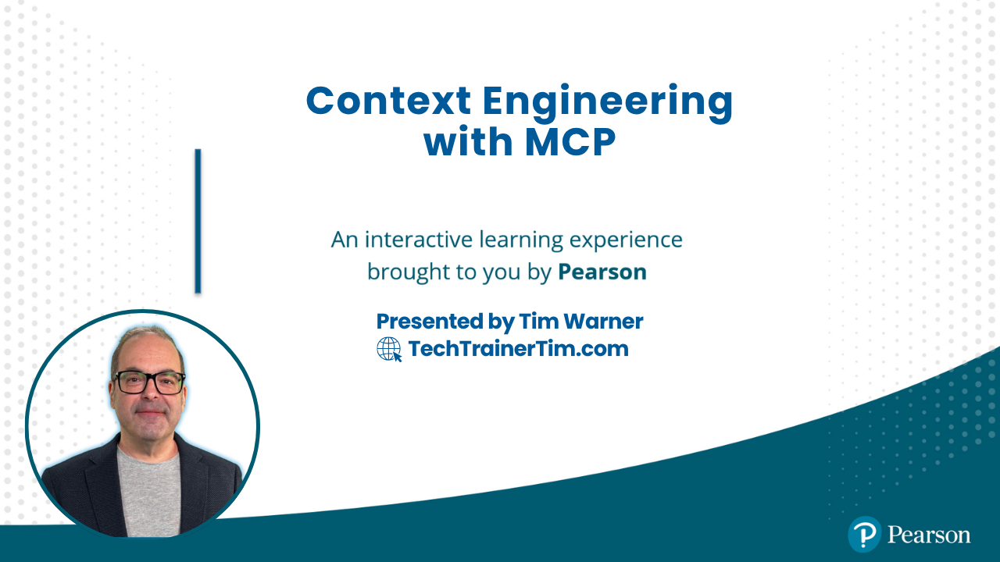

# Context Engineering with MCP: Build AI Systems That Actually Remember



Welcome to the training hub for mastering **Context Engineering with Model Context Protocol (MCP)**. This course teaches you to implement production-ready semantic memory systems for AI assistants using Python, FastAPI, FastMCP, and LangGraph.

---

## Quick Start

### Prerequisites

- **Python 3.13** (pinned in `.python-version`) — `onnxruntime` (a chromadb dependency) does not yet ship 3.14 wheels
- Node.js 20+ (for Lab 01 and MCP Inspector)
- [uv](https://docs.astral.sh/uv/) package manager (recommended for Python)
- Claude Desktop or Claude Code

### Option 1: Hello MCP Lab (Beginner Entry Point)

```bash
git clone https://github.com/timothywarner-org/context-engineering.git
cd context-engineering/labs/lab-01-hello-mcp/starter
npm install && npm start

# Test with MCP Inspector (in another terminal)
npx @modelcontextprotocol/inspector node src/index.js
```

### Option 1.5: MCP Chat CLI Lab (Python Bridge)

```powershell
cd labs/lab-02-mcp-chat
.\run.ps1
```

`run.ps1` is the **on-rails launcher**: it bootstraps `.env`, lifts `ANTHROPIC_API_KEY` from the repo-root `.env`, and launches the chat REPL. **Lab 02** is the smallest complete Python **MCP client + stdio server + REPL** in the repo - the conceptual bridge between Lab 01 (JS hello-world) and WARNERCO (production-shaped).

### Option 1.7: MCP Apps Lab (Interactive UI Surfaces)

```bash
cd labs/lab-03-mcp-apps
```

**Lab 03** ships three npm MCP servers (budget-allocator, map, system-monitor) that render interactive `ui://` surfaces in Claude Desktop via SEP-1865 (MCP Apps extension, spec 2026-01-26). See [`labs/lab-03-mcp-apps/README.md`](labs/lab-03-mcp-apps/README.md).

### Option 1.9: Remote MCP + OAuth on Azure

**Lab 04** is a remote MCP server secured by Entra ID OAuth, fronted by Azure API Management as the authorization-server facade, with an Azure Functions Python backend. Deploy with `azd up`, connect per [`remote-mcp-apim-functions-python/QUICKSTART.md`](remote-mcp-apim-functions-python/QUICKSTART.md), then tear down the same day with `azd down --purge --force`.

### Option 2: WARNERCO Schematica (Flagship Teaching App)

```bash
cd src/warnerco/backend
uv sync
uv run uvicorn app.main:app --reload    # HTTP server at http://localhost:8000
uv run warnerco-mcp                      # MCP stdio server for Claude Desktop
uv run warnerco-restart                  # Force-kill port 8000 and restart uvicorn
```

The `warnerco-restart` command (from `scripts/restart_server.py`) terminates anything bound to port 8000 (Windows: `netstat` + `taskkill /F /T`; POSIX: `lsof` + `SIGKILL`) before restarting. Flags: `--kill-only`, `--port N`.

---

## Course Structure (4 x 50 Minutes)

| Segment | Topic                          | Focus                                                                       |
| ------- | ------------------------------ | --------------------------------------------------------------------------- |
| **1**   | Context, Made Visible          | Consumer LLMs hide context; dev tools (Claude Code, Copilot) expose it       |
| **2**   | MCP: Standard for Context      | The protocol + a server on the official `mcp` SDK; current best practices    |
| **3**   | Memory Tiers in a Real App     | WARNERCO's four CoALA tiers live; orchestration kept under the hood          |
| **4**   | MCP in the Tools You Use       | Claude Code + GitHub Copilot in VS Code as context-engineering surfaces      |

Full plan: `instructor/course-plan-june-2026.md` (context-first, official-SDK-first; delivered 2026-06-30). The earlier orchestration-forward plan is archived under `instructor/archive/`.

### Segment Notebooks

`notebooks/segment-1.ipynb` through `segment-4.ipynb` are four **prepopulated, verified teaching notebooks**, one per 50-minute segment. Each opens with a **repo-root anchor cell** that walks up to `.git`, so it runs from any working directory. They print **live counts** (never hardcoded), and Segment 3 runs the full pipeline with live Anthropic prose. Open them in **VS Code with the Jupyter extension** and **Run All**. Verified to run error-free from both the repo root and `notebooks/`.

---

## WARNERCO Schematica Architecture

The flagship teaching application exercises **all four CoALA memory tiers** (Sumers et al. 2024) in a 9-node LangGraph pipeline:

```
+--------------------------------------------------------------------------+
|                          FastAPI + FastMCP                               |
+--------------------------------------------------------------------------+
|  LangGraph Flow (9-node CoALA-tiered RAG)                                |
|  parse_intent -> query_graph -> inject_scratchpad -> recall_episodes ->  |
|  retrieve -> compress_context -> reason -> respond -> log_episode        |
+--------------------------------------------------------------------------+
|  Four CoALA Memory Tiers                                                 |
|  +------------+  +-----------+  +----------+  +------------------------+ |
|  | Working    |  | Episodic  |  | Semantic |  | Procedural             | |
|  | Scratchpad |  | events.db |  | Vector   |  | MCP Prompts (versioned)| |
|  | (SQLite)   |  | (SQLite)  |  | store    |  | catalog://procedural   | |
|  +------------+  +-----------+  +----------+  +------------------------+ |
+--------------------------------------------------------------------------+
|  Consolidation ("sleep cycle"): scratchpad+episodic --(ctx.sample)--> semantic |
+--------------------------------------------------------------------------+
```

### CoALA Tier Reference

| Tier        | What it stores                                | Backed by                            | LangGraph node                          |
| ----------- | --------------------------------------------- | ------------------------------------ | --------------------------------------- |
| Working     | Session observations & inferences             | `data/scratchpad/notes.db` (SQLite)  | `inject_scratchpad`                     |
| Episodic    | Timestamped events with importance            | `data/episodic/events.db` (SQLite)   | `recall_episodes` + `log_episode`       |
| Semantic    | Durable facts (incl. consolidated `FACT-*`)   | Vector store (Chroma / Azure / JSON) | `retrieve`                              |
| Procedural  | Versioned skills/workflows                    | MCP `@mcp.prompt()` registrations    | (user-invoked, not in pipeline)         |

The **`reason` node** (LangGraph node 6) synthesizes prose via the official **`anthropic` Python SDK** (`AsyncAnthropic`); if the backend `.env` lacks the key it degrades gracefully - retrieval still works and the prose shows a fallback message.

Episodic recall uses **Park et al.'s scoring formula** — `α_recency · 0.5^(hours/half_life) + α_importance · stored + α_relevance · cosine(query, summary)` — and `warn_episodic_recall` returns the per-event score breakdown so students can see why each memory surfaced.

The knowledge graph is indexed at `src/warnerco/backend/data/graph/knowledge.db` with **117 entities** and **221 relationships** across 6 predicates (`has_tag`, `compatible_with`, `belongs_to_model`, `has_status`, `has_category`, `contains`).

### Progressive Tool Loading

The server registers **28 MCP tools**, **12 resources**, and **5 prompts**. Two meta-discovery tools implement progressive tool loading per Anthropic's "code execution with MCP" guidance:

- `warn_search_tools(query, detail, limit)` — keyword discovery with detail levels `name`, `summary`, `full`
- `warn_describe_tool(name)` — full schema for a single tool by name

Both meta-tools self-exclude from `warn_search_tools` results, so `count` is up to 26 even when `total` is 28. Clients can list tools cheaply, then pull full schemas only for what they actually plan to call.

---

## Repository Structure

```
context-engineering/
├── src/warnerco/backend/      # WARNERCO Schematica (FastAPI + FastMCP + LangGraph)
├── labs/lab-01-hello-mcp/     # Lab 01: Hello MCP, single add tool (JS)
├── labs/lab-02-mcp-chat/      # Lab 02: MCP client + server + chat REPL (Python, vendored)
├── labs/lab-03-mcp-apps/      # Lab 03: MCP Apps, interactive ui:// surfaces (JS/TS, SEP-1865)
├── remote-mcp-apim-functions-python/  # Lab 04: remote MCP + Entra ID OAuth via APIM (Python + bicep)
├── notebooks/                 # Four verified segment teaching notebooks (segment-1..4)
├── docs/                      # Student materials, tutorials, diagrams
├── instructor/                # Instructor-only materials
├── config/                    # Sample MCP client configurations
├── .vscode/                   # VS Code workspace configuration
├── .claude/                   # Claude Code agents and skills
└── CLAUDE.md                  # Development instructions (SOURCE OF TRUTH)
```

**For development details, see [CLAUDE.md](CLAUDE.md)** - the source of truth for:
- Complete MCP tool reference (28 tools)
- API endpoint documentation
- Environment variable configuration (incl. `EPISODIC_*`)
- 9-node LangGraph pipeline details
- All four CoALA memory tiers (Working / Episodic / Semantic / Procedural)

**For the framework explainer (read this first):** see [docs/tutorials/coala-explainer.md](docs/tutorials/coala-explainer.md) — what CoALA is and where each tier lives in the WARNERCO codebase.

**For the classroom demo:** see [docs/tutorials/coala-memory-walkthrough.md](docs/tutorials/coala-memory-walkthrough.md) — the ~4-minute four-tier classroom path.

---

## MCP Client Configuration

### Claude Desktop

**Windows**: `%APPDATA%\Claude\claude_desktop_config.json`
**Mac**: `~/Library/Application Support/Claude/claude_desktop_config.json`

```json
{
  "mcpServers": {
    "warnerco": {
      "command": "uv",
      "args": ["run", "warnerco-mcp"],
      "cwd": "C:/github/context-engineering/src/warnerco/backend"
    }
  }
}
```

### Claude Code (project scope)

`.claude/mcp.json` is checked in with two entries pointing at the same server: `claude-warnerco-schematica` and `claude-warnerco-coala-memory` (the second pre-pins the episodic-memory env vars for class demos).

### VS Code Copilot

`.vscode/mcp.json` is checked in with a single `vscode-warnerco-schematica` entry (`MEMORY_BACKEND=chroma`) plus the GitHub Copilot remote MCP server `ghcopilot-warner`. To list servers in VS Code: `Cmd/Ctrl+Shift+P → MCP: List Servers`.

---

## Testing with MCP Inspector

```bash
npx @modelcontextprotocol/inspector uv run warnerco-mcp
# Opens http://localhost:6274
```

---

## Resources

- **[MCP Specification](https://spec.modelcontextprotocol.io/)** - Official protocol documentation
- **[FastMCP Documentation](https://github.com/jlowin/fastmcp)** - Python MCP framework
- **[CLAUDE.md](CLAUDE.md)** - Development instructions for this repository

---

## Your Instructor

### Tim Warner

**Microsoft MVP** - Azure AI and Cloud/Datacenter Management
**Microsoft Certified Trainer** (25+ years)

- Website: [techtrainertim.com](https://techtrainertim.com)
- GitHub: [@timothywarner](https://github.com/timothywarner)
- LinkedIn: [linkedin.com/in/timothywarner](https://www.linkedin.com/in/timothywarner/)

---

## License

MIT License - 2026 Timothy Warner

---

**Now go build AI systems that actually remember!**
