# Architecture Diagrams for Context Journal MCP

## Phase 1: Local Development Architecture

## Phase 2: Azure Production Architecture

## MCP Tool Architecture

## Data Flow: Create Context Entry

```mermaid
sequenceDiagram
    participant User
    participant Claude
    participant MCP Server
    participant Pydantic
    participant Storage
    
    User->>Claude: "Save this context about Azure deployment"
    Claude->>Claude: Analyze request
    Claude->>MCP Server: create_context_entry(title, context, tags)
    
    MCP Server->>Pydantic: Validate input
    
    alt Validation Success
        Pydantic->>MCP Server: ✓ Valid
        MCP Server->>Storage: Write entry
        Storage->>MCP Server: Success (entry_id)
        MCP Server->>Claude: JSON response {success: true, entry_id: "ctx_0001"}
        Claude->>User: "Context saved successfully as ctx_0001"
    else Validation Failure
        Pydantic->>MCP Server: ✗ Invalid (errors)
        MCP Server->>Claude: Error response {success: false, error: "..."}
        Claude->>User: "Error: [explanation and suggestion]"
    end
```

## Data Flow: Search and Retrieve

## Migration Path: JSON to Cosmos DB

## Tool Annotation Effects

## Error Handling Flow

## Complete System Context

## Class Exercise: Add a Tool

---

## Using These Diagrams

### **In Presentations**
1. Copy the mermaid code block
2. Paste into any markdown renderer (GitHub, GitLab, VS Code with extensions)
3. Or use https://mermaid.live to generate PNG/SVG

### **In Claude**
- Claude can render mermaid diagrams directly
- Just paste the code blocks in conversation

### **In Documentation**
- GitHub and many platforms render mermaid automatically
- No need to generate static images

---

**All diagrams use consistent color scheme:**
- 🟣 Purple: User interfaces / Claude
- 🔵 Blue: MCP servers / Logic
- 🟢 Green: Storage / Success
- 🔴 Red: Errors / Destructive
- 🟠 Orange: Warnings / Monitoring
- ⚫ Gray: Deprecated / Old phase
