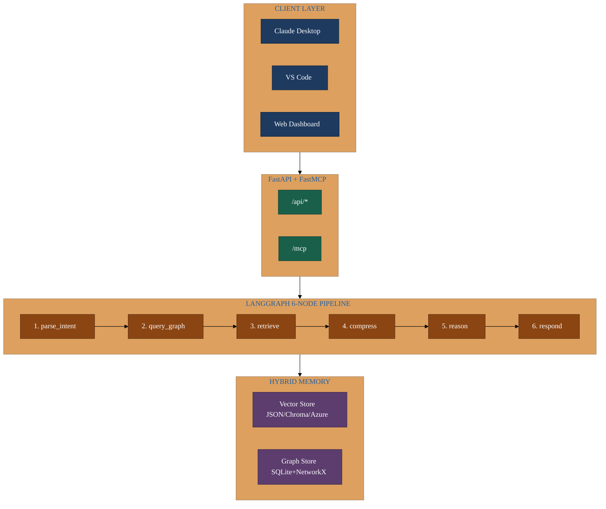

# MCP Architecture Diagrams

This directory provides supplementary architecture diagrams for the **Context Engineering with MCP** course.

## Primary Diagrams Location

The main architecture diagrams are in **[docs/diagrams/](../docs/diagrams/)**:

| Diagram | Description |
|---------|-------------|
| [system-overview.md](../docs/diagrams/system-overview.md) | Full WARNERCO Schematica architecture |
| [langgraph-flow.md](../docs/diagrams/langgraph-flow.md) | 6-node RAG pipeline details |
| [azure-deploy.md](../docs/diagrams/azure-deploy.md) | Azure production deployment |
| [mcp-primitives.md](../docs/diagrams/mcp-primitives.md) | MCP tools, resources, prompts |
| [graph-memory-architecture.md](../docs/diagrams/graph-memory-architecture.md) | Knowledge graph integration |

## Course Focus: WARNERCO Robotics Schematica

This course teaches MCP through a real-world implementation: **WARNERCO Robotics Schematica**, located at `src/warnerco/backend/`.

### Architecture Highlights



### Key Components

| Component | Technology | Purpose |
|-----------|------------|---------|
| **Server** | FastAPI + FastMCP | Unified HTTP/MCP endpoint |
| **RAG Pipeline** | LangGraph | 6-node hybrid retrieval |
| **Vector Store** | JSON/Chroma/Azure | Similarity search |
| **Graph Store** | SQLite + NetworkX | Relationship queries |
| **AI Services** | Azure OpenAI | Embeddings + reasoning |

### MCP Primitives

- **15 Tools**: CRUD operations, search, graph queries, interactive features
- **10 Resources**: Read-only data (memory, catalog, help, metadata)
- **5 Prompts**: Reusable templates (diagnostic, comparison, maintenance)
- **Elicitations**: Multi-turn user interactions

## Viewing Diagrams

### VS Code
Install the [Mermaid Preview extension](https://marketplace.visualstudio.com/items?itemName=vstirbu.vscode-mermaid-preview) and use the preview pane.

### GitHub
Mermaid diagrams render automatically in GitHub markdown.

### Mermaid Live Editor
Copy diagram code to [mermaid.live](https://mermaid.live/) for interactive editing.

### Export to PNG/SVG
```bash
npm install -g @mermaid-js/mermaid-cli
mmdc -i diagram.md -o diagram.svg -t dark
```

## Directory Contents

| File | Description |
|------|-------------|
| [INDEX.md](INDEX.md) | Complete diagram index with tool reference |
| [README.md](README.md) | This file |
| [warnerco-architecture.md](warnerco-architecture.md) | Detailed architecture diagram |

## Quick Start

```bash
# Start WARNERCO Schematica
cd src/warnerco/backend
uv sync
uv run uvicorn app.main:app --reload

# View at http://localhost:8000
# API docs at http://localhost:8000/docs
# MCP endpoint at http://localhost:8000/mcp
```

## Related Documentation

- **[CLAUDE.md](../CLAUDE.md)** - Project guidance for AI assistants
- **[docs/diagrams/](../docs/diagrams/)** - Primary diagram directory
- **[docs/tutorials/](../docs/tutorials/)** - Hands-on tutorials

---

**Course**: O'Reilly Live Training - Context Engineering with MCP
**Last Updated**: January 2026
