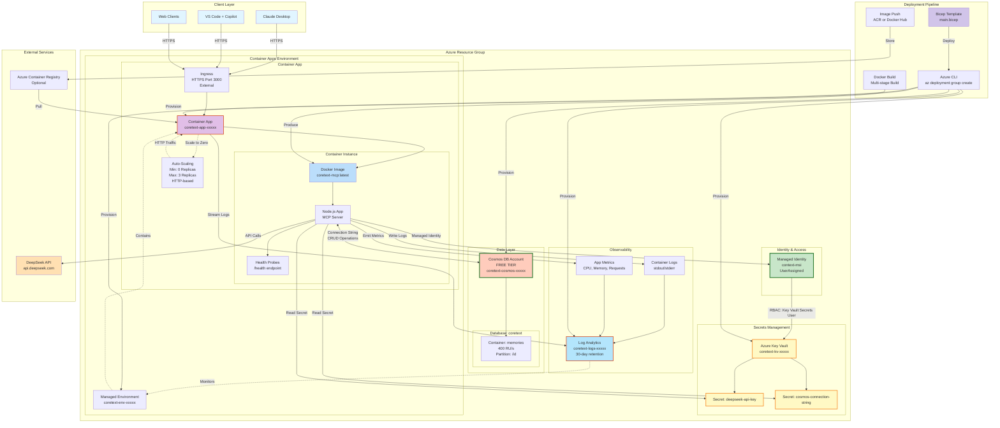

# CoreText MCP - Azure Architecture



## Architecture Overview

### Production Azure Setup

**Communication**: HTTPS over public internet
**Storage**: Azure Cosmos DB (Free Tier)
**Compute**: Azure Container Apps (Consumption Plan)
**Secrets**: Azure Key Vault with Managed Identity
**Monitoring**: Log Analytics Workspace

### Cost Breakdown (Estimated Monthly)

| Service | Tier | Monthly Cost |
|---------|------|--------------|
| Cosmos DB | Free Tier (1000 RU/s, 25GB) | $0.00 |
| Container Apps | Consumption (scale-to-zero) | $1-5 |
| Key Vault | Standard (per 10k ops) | ~$0.03 |
| Log Analytics | 30-day retention | $2-5 |
| Managed Identity | N/A | $0.00 |
| **TOTAL** | | **$3-10/month** |

### Key Azure Resources

#### 1. Managed Identity (`context-msi`)
- User-assigned identity for service-to-service auth
- No credentials in code or config
- RBAC permissions to Key Vault

#### 2. Key Vault (`coretext-kv-xxxxx`)
- Stores DeepSeek API key
- Stores Cosmos DB connection string
- RBAC authorization enabled
- 7-day soft delete retention

#### 3. Container Apps (`coretext-app-xxxxx`)
- Serverless container hosting
- Auto-scaling: 0-3 replicas
- HTTP ingress on port 3000
- Health checks: `/health` endpoint
- Environment variables from Key Vault secrets

#### 4. Cosmos DB (`coretext-cosmos-xxxxx`)
- Free Tier: 1000 RU/s shared, 25GB storage
- Database: `coretext`
- Container: `memories` (400 RU/s)
- Partition key: `/id`
- Session consistency level

#### 5. Log Analytics (`coretext-logs-xxxxx`)
- Centralized logging for Container Apps
- 30-day log retention
- Query with KQL (Kusto Query Language)
- Metrics and diagnostics

### Security Architecture

#### Authentication Flow
1. Container App starts with Managed Identity
2. MSI authenticates to Azure AD
3. MSI requests Key Vault secrets (RBAC check)
4. Key Vault returns secrets to app
5. App uses secrets to connect to Cosmos DB and DeepSeek API

#### RBAC Permissions
- **Key Vault Secrets User** role assigned to MSI
- Principal Type: ServicePrincipal
- Scope: Key Vault resource

#### Network Security
- HTTPS-only ingress (TLS 1.2+)
- Public endpoint (can be restricted to VNET)
- No credentials in environment variables (Key Vault references)

### Deployment Process

#### Prerequisites
```bash
# Azure CLI installed and authenticated
az login
az account set --subscription <subscription-id>

# Create resource group
az group create --name coretext-rg --location eastus

# Create managed identity
az identity create --name context-msi --resource-group coretext-rg
```

#### Build Docker Image
```bash
cd coretext-mcp

# Multi-stage build for production
docker build -t coretext-mcp:latest -f Dockerfile .

# Tag for Azure Container Registry (optional)
docker tag coretext-mcp:latest myacr.azurecr.io/coretext-mcp:latest

# Push to ACR
az acr login --name myacr
docker push myacr.azurecr.io/coretext-mcp:latest
```

#### Deploy with Bicep
```bash
# Deploy infrastructure
az deployment group create \
  --resource-group coretext-rg \
  --template-file azure/main.bicep \
  --parameters \
    managedIdentityName=context-msi \
    containerImage=myacr.azurecr.io/coretext-mcp:latest \
    deepseekApiKey=$DEEPSEEK_API_KEY

# Get Container App URL
az containerapp show \
  --name coretext-app-xxxxx \
  --resource-group coretext-rg \
  --query properties.configuration.ingress.fqdn \
  --output tsv
```

### Configuration

**Environment Variables** (injected by Container App):
```bash
DEEPSEEK_API_KEY=<from-key-vault>
COSMOS_CONNECTION_STRING=<from-key-vault>
NODE_ENV=production
PORT=3000
```

**Health Probes**:
- **Liveness**: `/health` every 30s (initial delay 10s)
- **Readiness**: `/health` every 10s (initial delay 5s)

### Scaling Configuration

**Auto-scaling Rules**:
- Trigger: HTTP concurrent requests
- Threshold: 10 concurrent requests
- Scale out: Add 1 replica
- Scale in: Remove replica after idle period
- Min replicas: 0 (scale-to-zero for cost savings)
- Max replicas: 3

**Cold Start**: ~5-10 seconds when scaling from 0→1

### Monitoring & Observability

#### Log Analytics Queries

**View recent logs**:
```kql
ContainerAppConsoleLogs_CL
| where ContainerAppName_s == "coretext-app-xxxxx"
| project TimeGenerated, Log_s
| order by TimeGenerated desc
| take 100
```

**Monitor memory operations**:
```kql
ContainerAppConsoleLogs_CL
| where Log_s contains "Created" or Log_s contains "Read" or Log_s contains "Updated"
| project TimeGenerated, Log_s
| order by TimeGenerated desc
```

**Health check failures**:
```kql
ContainerAppSystemLogs_CL
| where Log_s contains "health" and Log_s contains "fail"
| summarize count() by bin(TimeGenerated, 5m)
```

#### Metrics Dashboard
- Request count and latency
- CPU and memory utilization
- Active replica count
- Error rate and exceptions

### Migration from Local

#### Data Migration
```javascript
// Read local memory.json
const localData = JSON.parse(fs.readFileSync('data/memory.json'));

// Initialize Cosmos DB client
const { CosmosClient } = require('@azure/cosmos');
const client = new CosmosClient(process.env.COSMOS_CONNECTION_STRING);
const container = client.database('coretext').container('memories');

// Bulk import memories
for (const [id, memory] of Object.entries(localData)) {
  await container.items.create({
    id: id,
    ...memory
  });
}
```

#### Code Changes
Replace `MemoryManager` file I/O with Cosmos DB SDK:
- `fs.readFile()` → `container.item(id).read()`
- `fs.writeFile()` → `container.items.create()`
- Search → Cosmos DB SQL queries

### Production Considerations

#### High Availability
- Deploy to multiple regions (add locations to Cosmos DB)
- Use Traffic Manager for global load balancing
- Implement retry logic for transient failures

#### Performance Optimization
- Enable Cosmos DB indexing for search queries
- Implement caching layer (Azure Cache for Redis)
- Use connection pooling for Cosmos DB client

#### Security Hardening
- Restrict Container App ingress to VNET
- Enable Azure Front Door with WAF
- Implement API authentication (OAuth 2.0, API keys)
- Regular key rotation in Key Vault

#### Cost Optimization
- Monitor Cosmos DB RU/s consumption
- Use scale-to-zero during low-traffic periods
- Set budget alerts in Azure Cost Management
- Use Reserved Capacity for predictable workloads
