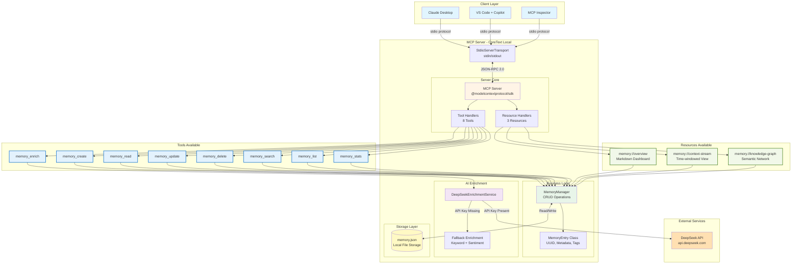

# CoreText MCP - Local Architecture



## Architecture Overview

### Local Development Setup

**Communication**: stdio transport over stdin/stdout
**Storage**: JSON file at `data/memory.json`
**AI Enrichment**: DeepSeek API with fallback to local NLP
**Deployment**: Single Node.js process on developer machine

### Memory Types

1. **Episodic Memory**: Time-based events and conversations
2. **Semantic Memory**: Facts, knowledge, and concepts

### Key Features

- 8 CRUD tools for memory operations
- 3 resources for context visualization
- UUID-based memory identification
- Auto-creates 3 demo memories on first run
- Graceful API fallback when no key provided
- Access tracking and statistics

### Data Flow

1. Client sends tool/resource request via stdio
2. MCP Server receives JSON-RPC 2.0 message
3. Request routed to appropriate handler
4. MemoryManager performs CRUD operation
5. Optional DeepSeek enrichment
6. Data persisted to `memory.json`
7. Response returned via stdio

### Configuration

**Location**: `.env` file in project root

```bash
DEEPSEEK_API_KEY=sk-xxxxx  # Optional, falls back to local enrichment
```

**Claude Desktop Config**: `%APPDATA%\Claude\claude_desktop_config.json`

```json
{
  "mcpServers": {
    "coretext": {
      "command": "node",
      "args": ["C:/path/to/coretext-mcp/src/index.js"],
      "env": {
        "DEEPSEEK_API_KEY": "sk-xxxxx"
      }
    }
  }
}
```

### Performance Characteristics

- Memory operations: <10ms (local JSON)
- Search latency: <50ms (linear scan)
- Enrichment: 500-2000ms (API dependent)
- Storage limit: 100MB (JSON file size)

### Development Workflow

```bash
npm install          # Install dependencies
npm run dev         # Start with auto-reload
npm run inspector   # Open MCP Inspector UI
npm test           # Run test suite (14 tests)
```
