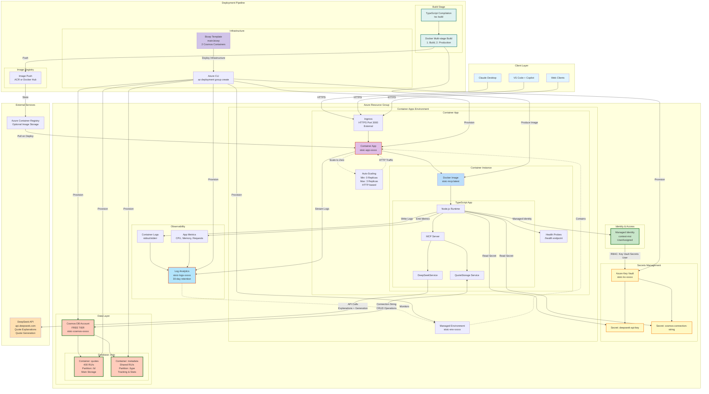

# Stoic MCP - Azure Architecture



## Architecture Overview

### Production Azure Setup

**Language**: TypeScript (compiled in Docker build)
**Communication**: HTTPS over public internet
**Storage**: Azure Cosmos DB (Free Tier) with 2 containers
**Compute**: Azure Container Apps (Consumption Plan)
**Secrets**: Azure Key Vault with Managed Identity
**Monitoring**: Log Analytics Workspace

### Cost Breakdown (Estimated Monthly)

| Service | Tier | Monthly Cost |
|---------|------|--------------|
| Cosmos DB | Free Tier (1000 RU/s, 25GB) | $0.00 |
| - Container: quotes | 400 RU/s provisioned | (included) |
| - Container: metadata | Shared throughput | (included) |
| Container Apps | Consumption (scale-to-zero) | $1-5 |
| Key Vault | Standard (per 10k ops) | ~$0.03 |
| Log Analytics | 30-day retention | $2-5 |
| Managed Identity | N/A | $0.00 |
| **TOTAL** | | **$3-10/month** |

### Key Azure Resources

#### 1. Managed Identity (`context-msi`)
- User-assigned identity for service-to-service auth
- Shared across both MCP servers (CoreText + Stoic)
- No credentials in code or config
- RBAC permissions to Key Vault

#### 2. Key Vault (`stoic-kv-xxxxx`)
- Stores DeepSeek API key
- Stores Cosmos DB connection string
- RBAC authorization enabled
- 7-day soft delete retention
- Secrets referenced by Container App

#### 3. Container Apps (`stoic-app-xxxxx`)
- Serverless container hosting
- Auto-scaling: 0-3 replicas
- HTTP ingress on port 3000
- Health checks: `/health` endpoint
- Environment variables from Key Vault secrets

#### 4. Cosmos DB (`stoic-cosmos-xxxxx`)
- Free Tier: 1000 RU/s shared, 25GB storage
- Database: `stoic`
- **Container 1**: `quotes` (400 RU/s dedicated)
  - Stores quote objects
  - Partition key: `/id`
  - Optimized indexing (excludes `_etag`)
- **Container 2**: `metadata` (shared throughput)
  - Stores usage statistics
  - Partition key: `/type`
  - Tracks favorites count, access patterns, themes

#### 5. Log Analytics (`stoic-logs-xxxxx`)
- Centralized logging for Container Apps
- 30-day log retention
- Query with KQL (Kusto Query Language)
- Metrics and diagnostics

### Cosmos DB Schema

#### Quotes Container (`quotes`)

```json
{
  "id": "42",
  "text": "You have power over your mind - not outside events.",
  "author": "Marcus Aurelius",
  "source": "Meditations",
  "theme": "control",
  "favorite": true,
  "notes": "Remember this during debugging!",
  "createdAt": "2025-10-30T12:34:56.789Z",
  "addedBy": "user"
}
```

**Partition Key**: `/id` (string representation of quote ID)

**Indexing Policy**:
```json
{
  "indexingMode": "consistent",
  "includedPaths": [{ "path": "/*" }],
  "excludedPaths": [{ "path": "/\"_etag\"/?" }]
}
```

#### Metadata Container (`metadata`)

```json
{
  "id": "stats",
  "type": "global",
  "totalQuotes": 128,
  "totalFavorites": 15,
  "themeDistribution": {
    "control": 22,
    "courage": 18,
    "mindset": 31
  },
  "lastModified": "2025-10-30T12:34:56.789Z"
}
```

**Partition Key**: `/type` (e.g., "global", "user", "theme")

### Security Architecture

#### Authentication Flow
1. Container App starts with Managed Identity
2. MSI authenticates to Azure AD
3. MSI requests Key Vault secrets (RBAC check)
4. Key Vault returns secrets to app
5. App uses secrets to connect to Cosmos DB and DeepSeek API

#### RBAC Permissions
- **Key Vault Secrets User** role assigned to MSI
- Principal Type: ServicePrincipal
- Scope: Key Vault resource
- Role ID: `4633458b-17de-408a-b874-0445c86b69e6`

#### Network Security
- HTTPS-only ingress (TLS 1.2+)
- Public endpoint (can be restricted to VNET)
- No credentials in environment variables (Key Vault references)
- Cosmos DB connection via managed identity possible (optional enhancement)

### Docker Build Process

#### Multi-stage Dockerfile

**Stage 1: Build**
```dockerfile
FROM node:20-alpine AS builder
WORKDIR /app
COPY local/package*.json ./
COPY local/tsconfig.json ./
COPY local/src ./src
RUN npm ci
RUN npm run build
```

**Stage 2: Production**
```dockerfile
FROM node:20-alpine
WORKDIR /app
COPY --from=builder /app/dist ./dist
COPY --from=builder /app/node_modules ./node_modules
COPY local/package*.json ./
EXPOSE 3000
HEALTHCHECK --interval=30s --timeout=3s --start-period=10s \
  CMD node -e "require('http').get('http://localhost:3000/health', (r) => { process.exit(r.statusCode === 200 ? 0 : 1); })"
CMD ["node", "dist/index.js"]
```

**Benefits**:
- Smaller production image (no TypeScript compiler)
- Build artifacts excluded
- Security: minimal attack surface
- Performance: faster startup

### Deployment Process

#### Prerequisites

```bash
# Azure CLI installed and authenticated
az login
az account set --subscription <subscription-id>

# Create resource group
az group create --name stoic-rg --location eastus

# Create managed identity (shared with CoreText)
az identity create --name context-msi --resource-group stoic-rg
```

#### Build Docker Image

```bash
cd stoic-mcp

# Build production image
docker build -t stoic-mcp:latest -f Dockerfile .

# Test locally
docker run -p 3000:3000 \
  -e DEEPSEEK_API_KEY=$DEEPSEEK_API_KEY \
  -e COSMOS_CONNECTION_STRING=$COSMOS_CONNECTION_STRING \
  stoic-mcp:latest

# Tag for Azure Container Registry
docker tag stoic-mcp:latest myacr.azurecr.io/stoic-mcp:latest

# Push to ACR
az acr login --name myacr
docker push myacr.azurecr.io/stoic-mcp:latest
```

#### Deploy Infrastructure with Bicep

```bash
# Deploy all Azure resources
az deployment group create \
  --resource-group stoic-rg \
  --template-file azure/main.bicep \
  --parameters \
    managedIdentityName=context-msi \
    containerImage=myacr.azurecr.io/stoic-mcp:latest \
    deepseekApiKey=$DEEPSEEK_API_KEY

# Get deployment outputs
az deployment group show \
  --resource-group stoic-rg \
  --name main \
  --query properties.outputs

# Get Container App URL
STOIC_URL=$(az containerapp show \
  --name stoic-app-xxxxx \
  --resource-group stoic-rg \
  --query properties.configuration.ingress.fqdn \
  --output tsv)

echo "Stoic MCP available at: https://$STOIC_URL"
```

### Configuration

#### Environment Variables (Container App)

```bash
# From Key Vault secrets
DEEPSEEK_API_KEY=<secret-reference>
COSMOS_CONNECTION_STRING=<secret-reference>

# Container-specific
COSMOS_DATABASE=stoic
COSMOS_CONTAINER_QUOTES=quotes
COSMOS_CONTAINER_METADATA=metadata

# Runtime
NODE_ENV=production
PORT=3000
```

#### Health Probes

**Liveness Probe**:
- Path: `/health`
- Interval: 30 seconds
- Initial delay: 10 seconds
- Timeout: 3 seconds

**Readiness Probe**:
- Path: `/health`
- Interval: 10 seconds
- Initial delay: 5 seconds
- Timeout: 3 seconds

**Health Endpoint Response**:
```json
{
  "status": "healthy",
  "timestamp": "2025-10-30T12:34:56.789Z",
  "quoteCount": 128,
  "cosmosConnected": true,
  "deepseekConfigured": true
}
```

### Scaling Configuration

**Auto-scaling Rules**:
- Trigger: HTTP concurrent requests
- Threshold: 10 concurrent requests
- Scale out: Add 1 replica
- Scale in: Remove replica after idle period
- Min replicas: 0 (scale-to-zero for cost savings)
- Max replicas: 3
- CPU: 0.25 cores per replica
- Memory: 0.5 GiB per replica

**Cold Start Performance**:
- Time: ~5-10 seconds (from 0→1 replica)
- Factors: Image pull, Node.js startup, Cosmos DB connection
- Mitigation: Keep-alive pings, minimum 1 replica for production

### Migration from Local

#### Data Migration Script

```typescript
import { CosmosClient } from '@azure/cosmos';
import fs from 'fs/promises';

async function migrateToAzure() {
  // Read local quotes.json
  const localData = JSON.parse(
    await fs.readFile('local/quotes.json', 'utf-8')
  );

  // Initialize Cosmos DB client
  const client = new CosmosClient(process.env.COSMOS_CONNECTION_STRING);
  const database = client.database('stoic');
  const quotesContainer = database.container('quotes');
  const metadataContainer = database.container('metadata');

  // Migrate quotes
  for (const quote of localData.quotes) {
    await quotesContainer.items.create({
      id: quote.id.toString(),
      ...quote
    });
    console.log(`Migrated quote ${quote.id}`);
  }

  // Create metadata document
  await metadataContainer.items.create({
    id: 'stats',
    type: 'global',
    lastId: localData.metadata.lastId,
    version: localData.metadata.version,
    totalQuotes: localData.quotes.length,
    totalFavorites: localData.quotes.filter(q => q.favorite).length,
    lastModified: new Date().toISOString()
  });

  console.log('✅ Migration complete!');
}

migrateToAzure().catch(console.error);
```

#### Code Changes for Cosmos DB

**Replace QuoteStorage class methods**:

```typescript
// Before (local JSON)
async getAllQuotes() {
  const data = JSON.parse(await fs.readFile('quotes.json'));
  return data.quotes;
}

// After (Cosmos DB)
async getAllQuotes() {
  const { resources } = await this.container.items
    .query('SELECT * FROM c')
    .fetchAll();
  return resources;
}
```

**Add Cosmos DB client initialization**:

```typescript
import { CosmosClient } from '@azure/cosmos';

const client = new CosmosClient(process.env.COSMOS_CONNECTION_STRING);
const database = client.database('stoic');
const quotesContainer = database.container('quotes');
const metadataContainer = database.container('metadata');
```

### Monitoring & Observability

#### Log Analytics Queries

**View recent quote operations**:
```kql
ContainerAppConsoleLogs_CL
| where ContainerAppName_s == "stoic-app-xxxxx"
| where Log_s contains "quote" or Log_s contains "Quote"
| project TimeGenerated, Log_s
| order by TimeGenerated desc
| take 100
```

**Monitor AI API calls**:
```kql
ContainerAppConsoleLogs_CL
| where Log_s contains "DeepSeek" or Log_s contains "AI"
| summarize count() by bin(TimeGenerated, 1h)
| render timechart
```

**Track favorite quote activity**:
```kql
ContainerAppConsoleLogs_CL
| where Log_s contains "favorite"
| summarize FavoriteToggles = count() by bin(TimeGenerated, 1d)
| render columnchart
```

**Health check failures**:
```kql
ContainerAppSystemLogs_CL
| where Log_s contains "health" and Log_s contains "fail"
| summarize FailureCount = count() by bin(TimeGenerated, 5m)
| render timechart
```

#### Metrics Dashboard

**Key Performance Indicators**:
- Request count and latency (p50, p95, p99)
- Quote operations per minute
- AI explanation success rate
- Cosmos DB RU/s consumption
- Active replica count
- Error rate and exceptions

**Cost Tracking**:
- Cosmos DB request units consumed
- Container Apps execution time
- Key Vault operations
- Bandwidth (ingress/egress)

### Production Considerations

#### High Availability

**Multi-region Deployment**:
```bash
# Add secondary region to Cosmos DB
az cosmosdb update \
  --name stoic-cosmos-xxxxx \
  --resource-group stoic-rg \
  --locations regionName=eastus failoverPriority=0 \
  --locations regionName=westus failoverPriority=1
```

**Traffic Distribution**:
- Azure Traffic Manager for global load balancing
- Health checks every 30 seconds
- Automatic failover on region failure

#### Performance Optimization

**Cosmos DB**:
- Enable server-side retry for throttling
- Use bulk operations for imports (up to 100 items)
- Implement connection pooling (reuse CosmosClient)
- Cache frequently accessed quotes in memory

**Container Apps**:
- Pre-warm containers with minimum 1 replica
- Use Azure Front Door for CDN caching
- Implement rate limiting (10 requests/second per client)

**AI Integration**:
- Cache DeepSeek API responses (TTL: 24 hours)
- Batch explanation requests when possible
- Implement circuit breaker for API failures

#### Security Hardening

**Network Isolation**:
```bash
# Restrict Container App to VNET
az containerapp update \
  --name stoic-app-xxxxx \
  --resource-group stoic-rg \
  --ingress internal
```

**API Authentication**:
- Implement OAuth 2.0 or API key validation
- Use Azure AD authentication for enterprise
- Rate limiting per authenticated user

**Cosmos DB Security**:
- Enable firewall rules (restrict to Container App IP)
- Use managed identity instead of connection string
- Enable audit logging for compliance

#### Cost Optimization

**Monitor RU/s Consumption**:
```kql
// Query Cosmos DB metrics
AzureDiagnostics
| where ResourceProvider == "MICROSOFT.DOCUMENTDB"
| where MetricName_s == "TotalRequestUnits"
| summarize TotalRU = sum(Total_d) by bin(TimeGenerated, 1h)
| render timechart
```

**Right-size Resources**:
- Reduce quote container RU/s to 400 minimum
- Use scale-to-zero during non-business hours
- Set budget alerts at $5, $8, $10 thresholds
- Review and delete unused metadata documents

**Reserved Capacity** (for predictable workloads):
- 1-year commitment: 20% discount
- 3-year commitment: 30% discount
- Only after 3+ months of stable usage

### Troubleshooting

#### Common Issues

**Container fails to start**:
```bash
# Check logs
az containerapp logs show \
  --name stoic-app-xxxxx \
  --resource-group stoic-rg \
  --tail 50

# Verify secrets
az containerapp secret list \
  --name stoic-app-xxxxx \
  --resource-group stoic-rg
```

**Cosmos DB connection timeout**:
- Verify connection string in Key Vault
- Check Cosmos DB firewall rules
- Ensure managed identity has permissions

**High latency**:
- Check Cosmos DB RU/s throttling (429 errors)
- Review container replica count
- Analyze Log Analytics performance queries

### Comparison: Local vs Azure

| Aspect | Local | Azure |
|--------|-------|-------|
| **Storage** | JSON file (100MB limit) | Cosmos DB (unlimited) |
| **Scalability** | Single process | 0-3 auto-scaled replicas |
| **Availability** | Developer machine only | 99.95% SLA |
| **Cost** | $0 (local resources) | $3-10/month |
| **Security** | .env file | Key Vault + RBAC |
| **Monitoring** | Console logs | Log Analytics + Metrics |
| **Backup** | Git commits | Cosmos DB auto-backup |
| **Cold Start** | Instant | 5-10 seconds |

### Next Steps

1. **Deploy Development Environment**: Test with staging resource group
2. **Data Migration**: Import existing quotes from local JSON
3. **Load Testing**: Validate auto-scaling with `ab` or `k6`
4. **Cost Monitoring**: Set up alerts and spending limits
5. **Documentation**: Update team runbooks with Azure URLs
6. **CI/CD Pipeline**: Automate builds with GitHub Actions
7. **Multi-region**: Expand to West US for redundancy
