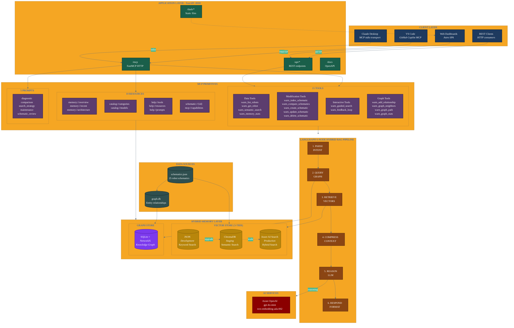

# WARNERCO Robotics Schematica - Complete Architecture

## System Overview



## Architecture Summary

### Client Layer
- **Claude Desktop**: Native MCP stdio transport for desktop AI assistant
- **VS Code**: GitHub Copilot with MCP extension support
- **Web Dashboards**: Astro-built SPA served from /dash/
- **REST Clients**: Direct HTTP API access for integrations

### Application Layer (FastAPI :8000)
- **/api/*** - REST endpoints for programmatic access
- **/mcp** - FastMCP HTTP endpoint for remote MCP clients
- **/dash/*** - Static file serving for Astro dashboards
- **/docs** - OpenAPI documentation

### MCP Primitives

#### 15 Tools

| Category | Tools | Purpose |
|----------|-------|---------|
| **Data** | `warn_list_robots`, `warn_get_robot`, `warn_semantic_search`, `warn_memory_stats` | Read operations |
| **Modification** | `warn_index_schematic`, `warn_compare_schematics`, `warn_create_schematic`, `warn_update_schematic`, `warn_delete_schematic` | Write operations |
| **Interactive** | `warn_guided_search`, `warn_feedback_loop` | Multi-turn with elicitations |
| **Graph** | `warn_add_relationship`, `warn_graph_neighbors`, `warn_graph_path`, `warn_graph_stats` | Knowledge graph operations |

#### 10 Resources

| URI Pattern | Description |
|-------------|-------------|
| `memory://overview` | Memory system status |
| `memory://recent` | Recently accessed schematics |
| `memory://architecture` | System architecture info |
| `catalog://categories` | List of schematic categories |
| `catalog://models` | List of robot models |
| `help://tools` | Tool documentation |
| `help://resources` | Resource documentation |
| `help://prompts` | Prompt documentation |
| `schematic://{id}` | Individual schematic data |
| `mcp://capabilities` | Server capabilities |

#### 5 Prompts

| Prompt | Purpose |
|--------|---------|
| `diagnostic` | Troubleshooting guidance |
| `comparison` | Schematic comparison |
| `search_strategy` | Search optimization |
| `maintenance` | Maintenance procedures |
| `schematic_review` | Technical review |

### LangGraph 6-Node Pipeline

```
parse_intent --> query_graph --> retrieve --> compress_context --> reason --> respond
```

| Node | Function | Input | Output |
|------|----------|-------|--------|
| 1. `parse_intent` | Classify query type | Raw query | Intent (lookup/diagnostic/analytics/search) |
| 2. `query_graph` | Knowledge graph enrichment | Intent + query | Graph context (related entities) |
| 3. `retrieve` | Vector similarity search | Graph context + query | Candidate schematics |
| 4. `compress_context` | Token optimization | Candidates + graph context | Compressed context string |
| 5. `reason` | LLM synthesis | Compressed context | Reasoning explanation |
| 6. `respond` | Format output | All state | JSON response |

### Hybrid Memory Layer

#### Vector Store (3-Tier)

| Tier | Backend | Use Case | Features |
|------|---------|----------|----------|
| **Development** | JSON | Local dev | Keyword search, zero config |
| **Staging** | ChromaDB | Testing | Semantic search, local vectors |
| **Production** | Azure AI Search | Enterprise | Hybrid search, scale, SLA |

Set via `MEMORY_BACKEND` environment variable.

#### Graph Store

- **SQLite**: Persistent storage for entity relationships
- **NetworkX**: In-memory graph for fast traversal algorithms
- **Predicates**: `depends_on`, `contains`, `has_status`, `manufactured_by`, `compatible_with`, `related_to`

### AI Services

- **Azure OpenAI gpt-4o-mini**: Reasoning and synthesis
- **Azure OpenAI text-embedding-ada-002**: Vector embeddings

## Data Flow

### Query Flow

```
1. Client sends query via MCP or REST
2. parse_intent classifies query type
3. query_graph enriches with knowledge graph relationships
4. retrieve performs vector search
5. compress_context minimizes token usage
6. reason synthesizes response (LLM or stub)
7. respond formats for client consumption
```

### Indexing Flow

```
1. schematics.json contains 25 robot schematics
2. Vector indexing: JSON -> ChromaDB -> Azure AI Search
3. Graph indexing: scripts/index_graph.py -> graph.db -> NetworkX
```

## Quick Start

```bash
# Navigate to WARNERCO backend
cd src/warnerco/backend

# Install dependencies
uv sync

# Start server (development)
uv run uvicorn app.main:app --reload

# Access points:
# - Dashboard: http://localhost:8000/dash/
# - API docs:  http://localhost:8000/docs
# - MCP:       http://localhost:8000/mcp
```

## Configuration

### Environment Variables

```bash
# Memory backend selection
MEMORY_BACKEND=json|chroma|azure_search

# Azure AI Search (production)
AZURE_SEARCH_ENDPOINT=https://your-search.search.windows.net
AZURE_SEARCH_KEY=your-key
AZURE_SEARCH_INDEX=warnerco-schematics

# Azure OpenAI (reasoning)
AZURE_OPENAI_ENDPOINT=https://your-openai.openai.azure.com/
AZURE_OPENAI_API_KEY=your-key
AZURE_OPENAI_DEPLOYMENT=gpt-4o-mini
AZURE_OPENAI_EMBEDDING_DEPLOYMENT=text-embedding-ada-002
```

## File Structure

```
src/warnerco/backend/
├── app/
│   ├── main.py              # FastAPI application
│   ├── mcp_tools.py         # 15 MCP tools + 10 resources + 5 prompts
│   ├── config.py            # Settings management
│   ├── api/                 # REST API routes
│   │   └── routes.py
│   ├── langgraph/
│   │   └── flow.py          # 6-node RAG pipeline
│   ├── adapters/
│   │   ├── __init__.py      # Factory functions
│   │   ├── base.py          # Abstract base class
│   │   ├── json_store.py    # JSON backend
│   │   ├── chroma_store.py  # ChromaDB backend
│   │   ├── azure_search_store.py  # Azure backend
│   │   └── graph_store.py   # SQLite + NetworkX
│   └── models/
│       ├── __init__.py
│       ├── schematic.py     # Schematic model
│       └── graph.py         # Entity/Relationship models
├── data/
│   ├── schematics/
│   │   └── schematics.json  # 25 robot schematics
│   ├── chroma/              # ChromaDB persistence
│   └── graph.db             # Knowledge graph
├── static/
│   └── dash/                # Astro SPA
└── scripts/
    ├── index_azure_search.py
    └── index_graph.py
```

---

**Course**: O'Reilly Live Training - Context Engineering with MCP
**Last Updated**: January 2026
