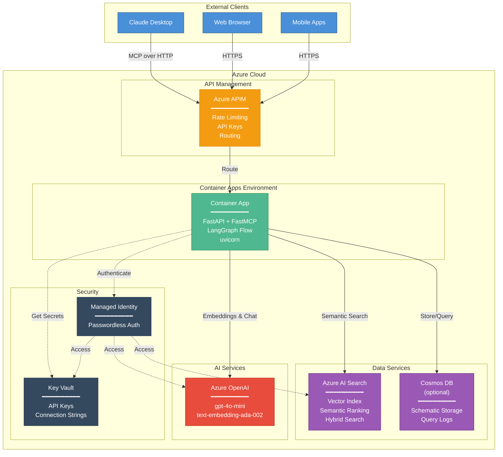

# WARNERCO Robotics Schematica - Azure Deployment

## Description

This diagram shows the Azure deployment architecture for WARNERCO Robotics Schematica:

- **External Clients**: Claude Desktop, web browsers, and mobile apps connect via HTTPS
- **API Management (APIM)**: Provides rate limiting, API key management, and routing
- **Container Apps**: Hosts the FastAPI + FastMCP application with LangGraph flow
- **Data Services**: Azure AI Search for vector/semantic search, optional Cosmos DB for storage
- **AI Services**: Azure OpenAI for embeddings (text-embedding-ada-002) and chat (gpt-4o-mini)
- **Security**: Key Vault for secrets, Managed Identity for passwordless authentication
