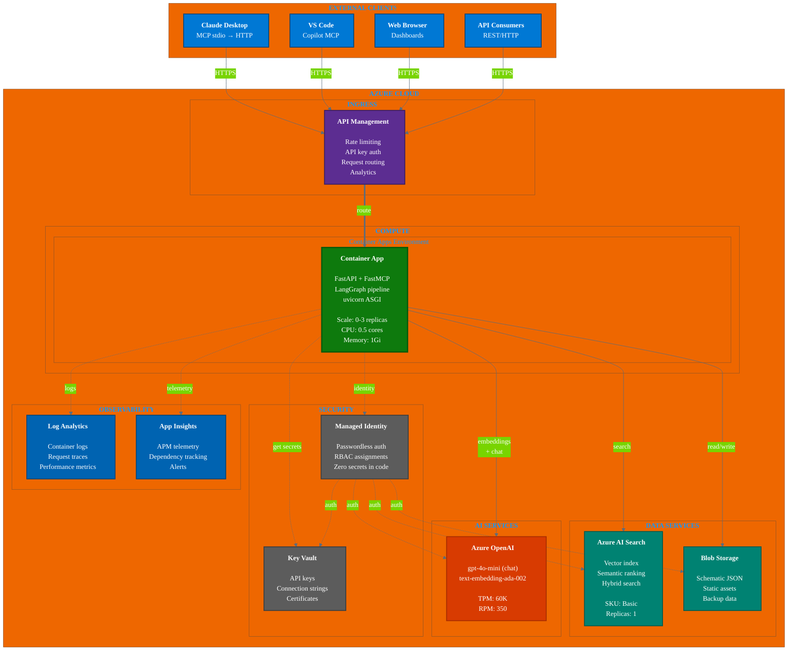

# WARNERCO Robotics Schematica - Azure Deployment



## Resource Inventory

### Resource Group: `warnerco-rg`

| Resource | Type | SKU | Monthly Cost Est. |
|----------|------|-----|-------------------|
| `warnerco-apim` | API Management | Consumption | ~$3.50 |
| `warnerco-app` | Container App | Consumption | ~$0-5 |
| `warnerco-search` | AI Search | Basic | ~$75 |
| `warnerco-openai` | Azure OpenAI | S0 | ~$0-20 |
| `warnercostorage` | Storage Account | Standard LRS | ~$1 |
| `warnerco-kv` | Key Vault | Standard | ~$0.03 |
| `warnerco-logs` | Log Analytics | Pay-per-GB | ~$2-5 |

**Total Estimated**: ~$85-110/month (classroom/demo workload)

## Deployment

### Prerequisites
```bash
# Login and set subscription
az login
az account set --subscription "Your-Subscription-Name"

# Create resource group
az group create --name warnerco-rg --location eastus
```

### Deploy with Bicep
```bash
cd src/warnerco/infra/bicep

# Deploy all resources
az deployment group create \
  --resource-group warnerco-rg \
  --template-file main.bicep \
  --parameters parameters.json
```

### Environment Variables (Container App)
```bash
MEMORY_BACKEND=azure_search
AZURE_SEARCH_ENDPOINT=https://warnerco-search.search.windows.net
AZURE_SEARCH_INDEX=warnerco-schematics
AZURE_OPENAI_ENDPOINT=https://warnerco-openai.openai.azure.com/
AZURE_OPENAI_DEPLOYMENT=gpt-4o-mini
AZURE_OPENAI_EMBEDDING_DEPLOYMENT=text-embedding-ada-002
```

## Security Architecture

### Managed Identity Flow
```
Container App
     │
     ├──► Key Vault (get secrets)
     │         └── RBAC: Key Vault Secrets User
     │
     ├──► Azure AI Search (search/index)
     │         └── RBAC: Search Index Data Contributor
     │
     ├──► Azure OpenAI (embeddings/chat)
     │         └── RBAC: Cognitive Services OpenAI User
     │
     └──► Blob Storage (read/write)
               └── RBAC: Storage Blob Data Contributor
```

### Zero Secrets Principle
- No API keys in code or environment variables
- Managed Identity authenticates to all services
- Key Vault stores only external/third-party secrets
- RBAC controls all access permissions

## Scaling

### Container Apps Scaling Rules
```yaml
scale:
  minReplicas: 0      # Scale to zero when idle
  maxReplicas: 3      # Handle traffic spikes
  rules:
    - name: http-rule
      http:
        metadata:
          concurrentRequests: "50"
```

### Cost Optimization
- **Scale to zero**: No charges when idle
- **Consumption tier**: Pay only for actual usage
- **Basic search**: Sufficient for <100K documents
- **Token limits**: Controlled via APIM policies
