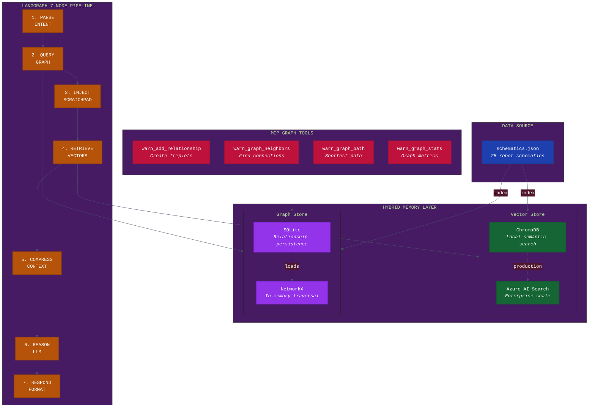
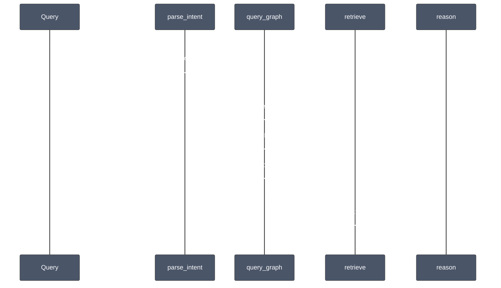
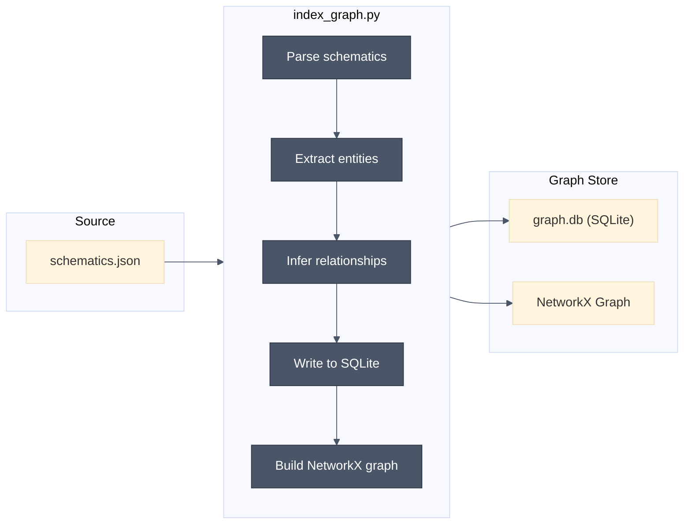

# Graph Memory Architecture

Graph Memory adds a Knowledge Graph layer to WARNERCO Schematica, enabling relationship-based queries alongside vector similarity search. This hybrid approach combines the strengths of both paradigms: semantic similarity for "find things like X" and graph traversal for "what connects to X."

## Why Graph Memory?

Vector search excels at semantic similarity but struggles with structured relationships. Consider these queries:

| Query | Vector Search | Graph Query |
|-------|--------------|-------------|
| "Find robots similar to Atlas Prime" | Excellent | Poor |
| "What components depend on the power system?" | Poor | Excellent |
| "Which robots use the same sensor type?" | Moderate | Excellent |
| "Robots for precision handling" | Excellent | Moderate |

**Graph Memory fills the gap** by modeling explicit relationships between entities: robots, components, systems, and categories.

## System Architecture



**Text description for accessibility**: The diagram shows data flowing from schematics.json into two parallel memory stores: Vector Store (ChromaDB/Azure AI Search) for semantic search and Graph Store (SQLite + NetworkX) for relationship queries. The LangGraph pipeline has 7 nodes that query both stores (including scratchpad injection), with dedicated MCP tools for graph operations.

## Component Details

### Graph Store (SQLite + NetworkX)

The graph store uses a dual-layer architecture:

1. **SQLite** - Persistent storage for relationships (triplets)
2. **NetworkX** - In-memory graph for fast traversal algorithms

This separation provides durability (SQLite survives restarts) with performance (NetworkX enables sub-millisecond path queries).

#### Data Model

```
Entity (node):
  - id: str (e.g., "WRN-00001")
  - type: str (robot | component | category | system)
  - properties: dict (name, model, category, etc.)

Relationship (edge):
  - subject: str (source entity ID)
  - predicate: str (relationship type)
  - object: str (target entity ID)
  - metadata: dict (timestamp, confidence, source)
```

#### Supported Predicates

| Predicate | Description | Example |
|-----------|-------------|---------|
| `depends_on` | Component dependency | WRN-00001 depends_on POW-SYSTEM |
| `contains` | Containment relationship | WC-100 contains WRN-00001 |
| `has_status` | Status assignment | WRN-00003 has_status active |
| `manufactured_by` | Manufacturing relationship | WRN-00001 manufactured_by WARNERCO |
| `compatible_with` | Compatibility link | WRN-00005 compatible_with WRN-00001 |
| `related_to` | General association | WRN-00004 related_to WRN-00007 |

### LangGraph Flow Integration

The `query_graph` node (Node 2) enriches the query context before vector retrieval:



**Text description**: Sequence diagram showing a query flowing through parse_intent (classifies as DIAGNOSTIC), then query_graph (extracts entities and finds neighbors), then retrieve (boosts candidates based on graph relationships), finally to reason (LLM synthesis).

### MCP Tool Integration

Four new MCP tools expose graph functionality:

```
warn_add_relationship
  - Purpose: Create a triplet in the knowledge graph
  - Input: subject, predicate, object, optional metadata
  - Output: Confirmation with relationship ID

warn_graph_neighbors
  - Purpose: Find all entities connected to a given entity
  - Input: entity_id, optional direction (in/out/both)
  - Output: List of connected entities with predicates

warn_graph_path
  - Purpose: Find shortest path between two entities
  - Input: source_id, target_id, optional max_hops
  - Output: Path as list of (entity, predicate, entity) triplets

warn_graph_stats
  - Purpose: Return graph statistics
  - Output: Node count, edge count, density, components
```

## Data Flow

### Indexing Flow



**Text description**: Data flows from schematics.json through the index_graph.py script which parses, extracts entities, infers relationships, and writes to both SQLite (persistence) and NetworkX (in-memory).

### Runtime Query Flow

1. **Intent classified** as requiring graph context (DIAGNOSTIC, ANALYTICS, or explicit graph query)
2. **Entity extraction** identifies key terms from query
3. **Graph query** finds related entities (neighbors, paths)
4. **Context enrichment** adds graph relationships to retrieval context
5. **Vector retrieval** uses enriched context, optionally boosting graph-connected results
6. **Compression** includes both vector and graph context
7. **Reasoning** synthesizes hybrid context for response

## File Structure

```
src/warnerco/backend/
├── app/
│   ├── models/
│   │   ├── __init__.py
│   │   └── graph.py              # Entity, Relationship, GraphQueryResult
│   ├── adapters/
│   │   ├── __init__.py
│   │   ├── graph_store.py        # SQLite + NetworkX implementation
│   │   ├── json_store.py         # Existing JSON store
│   │   ├── chroma_store.py       # Existing Chroma store
│   │   └── azure_search_store.py # Existing Azure store
│   ├── langgraph/
│   │   └── flow.py               # Updated with query_graph node
│   └── mcp_tools.py              # Updated with 4 graph tools
├── data/
│   └── graph.db                  # SQLite graph database
└── scripts/
    └── index_graph.py            # Graph indexing script
```

## Design Decisions

### Why SQLite + NetworkX?

**Considered alternatives**:
- Neo4j: Powerful but adds operational complexity
- Pure NetworkX: No persistence
- PostgreSQL with recursive CTEs: Overkill for this scale

**Decision rationale**: SQLite provides zero-config persistence that survives container restarts. NetworkX provides fast in-memory traversal with a rich algorithm library. The combination balances simplicity with capability.

### Why a Separate Node (query_graph)?

**Considered alternatives**:
- Integrate into retrieve node
- Run in parallel with retrieve

**Decision rationale**: Explicit separation allows:
- Clear telemetry (timing for graph vs. vector)
- Conditional execution (skip for pure semantic queries)
- Independent testing and debugging

### Schema-on-Read vs. Schema-on-Write

The graph store uses schema-on-read: any predicate string is valid. This provides flexibility during development and allows emergent relationship types.

**Trade-off**: Less type safety, more freedom to experiment.

## Performance Characteristics

| Operation | Typical Latency | Notes |
|-----------|-----------------|-------|
| Add relationship | <5ms | SQLite write + NetworkX update |
| Get neighbors | <1ms | NetworkX adjacency lookup |
| Shortest path | <10ms | NetworkX BFS/Dijkstra |
| Full graph load | ~100ms | Scales with relationship count |

The graph remains in memory after first load, so subsequent queries are fast.

## Next Steps

- [Tutorial: Knowledge Graphs for Context Engineering](../tutorials/graph-memory-tutorial.md)
- [Graph Memory API Reference](../api/graph-api.md)
