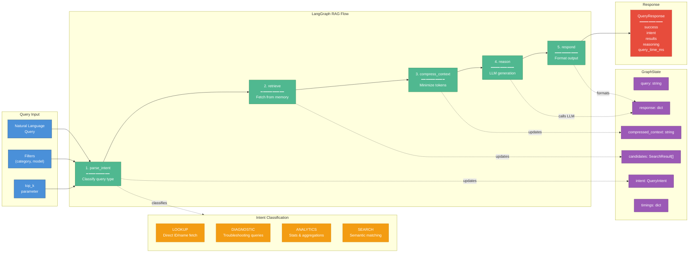

# WARNERCO Robotics Schematica - LangGraph RAG Flow

## Description

This diagram illustrates the 5-node LangGraph RAG (Retrieval-Augmented Generation) flow:

1. **parse_intent**: Classifies the query into one of four intent types (LOOKUP, DIAGNOSTIC, ANALYTICS, SEARCH)
2. **retrieve**: Fetches candidate schematics from the memory backend based on intent
3. **compress_context**: Minimizes token usage by extracting only relevant fields
4. **reason**: Calls Azure OpenAI (gpt-4o-mini) for intelligent response generation
5. **respond**: Formats the final output for dashboards and MCP consumers

The GraphState TypedDict tracks query, intent, candidates, compressed context, response, and timing telemetry throughout the flow.
