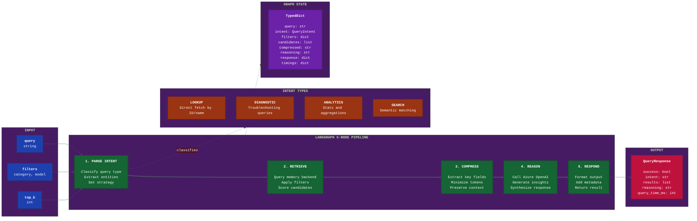

# WARNERCO Robotics Schematica - LangGraph RAG Flow



## Pipeline Details

### Node 1: Parse Intent
Analyzes the incoming query to determine the best retrieval strategy.

| Intent | Description | Strategy |
|--------|-------------|----------|
| **LOOKUP** | Direct ID or name reference | Exact match, bypass semantic |
| **DIAGNOSTIC** | "Why is X failing?" | Include specs, prioritize recent |
| **ANALYTICS** | "How many sensors?" | Aggregate, count operations |
| **SEARCH** | General semantic query | Vector similarity, ranking |

### Node 2: Retrieve
Fetches candidates from the active memory backend.

```python
# Chroma (semantic)
results = collection.query(
    query_texts=[compressed_query],
    n_results=top_k,
    where=filters
)

# JSON (keyword fallback)
results = [s for s in schematics if matches_filters(s, filters)]
```

### Node 3: Compress Context
Reduces token usage while preserving essential information.

- Extracts: `id`, `name`, `summary`, `category`
- Omits: full specifications, URLs, verbose metadata
- Target: <2000 tokens for LLM context

### Node 4: Reason
Calls Azure OpenAI with compressed context.

```python
response = await client.chat.completions.create(
    model="gpt-4o-mini",
    messages=[
        {"role": "system", "content": SYSTEM_PROMPT},
        {"role": "user", "content": f"Query: {query}\nContext: {compressed}"}
    ]
)
```

### Node 5: Respond
Formats the final response with metadata.

```python
return QueryResponse(
    success=True,
    intent=state["intent"],
    results=state["candidates"],
    reasoning=state["reasoning"],
    query_time_ms=elapsed
)
```

## State Management

The `GraphState` TypedDict maintains context across all nodes:

| Field | Type | Updated By |
|-------|------|------------|
| `query` | str | Input |
| `intent` | QueryIntent | Node 1 |
| `filters` | dict | Input |
| `candidates` | list[SearchResult] | Node 2 |
| `compressed_context` | str | Node 3 |
| `reasoning` | str | Node 4 |
| `response` | dict | Node 5 |
| `timings` | dict | All nodes |
