# WARNERCO Robotics Schematica - LangGraph Hybrid RAG Flow

```mermaid
%%{init: {'theme': 'base', 'themeVariables': { 'primaryColor': '#2d5016', 'primaryTextColor': '#fff', 'primaryBorderColor': '#1a3009', 'lineColor': '#4a5568', 'fontFamily': 'JetBrains Mono, monospace'}}}%%
flowchart LR
    subgraph Input["<b>INPUT</b>"]
        direction TB
        Q["<b>query</b><br/>string"]
        F["<b>filters</b><br/>category, model"]
        K["<b>top_k</b><br/>int"]
    end

    subgraph Pipeline["<b>LANGGRAPH 6-NODE HYBRID PIPELINE</b>"]
        direction LR

        N1["<b>1. PARSE INTENT</b><br/><br/>Classify query type<br/>Extract entities<br/>Set strategy"]

        N2["<b>2. QUERY GRAPH</b><br/><br/>Find relationships<br/>Get neighbors<br/>Enrich context"]

        N3["<b>3. RETRIEVE</b><br/><br/>Query vector store<br/>Apply filters<br/>Boost graph hits"]

        N4["<b>4. COMPRESS</b><br/><br/>Extract key fields<br/>Minimize tokens<br/>Preserve context"]

        N5["<b>5. REASON</b><br/><br/>Call Azure OpenAI<br/>Generate insights<br/>Synthesize response"]

        N6["<b>6. RESPOND</b><br/><br/>Format output<br/>Add metadata<br/>Return result"]

        N1 ==> N2 ==> N3 ==> N4 ==> N5 ==> N6
    end

    subgraph Intents["<b>INTENT TYPES</b>"]
        direction TB
        I1["<b>LOOKUP</b><br/>Direct fetch by ID/name"]
        I2["<b>DIAGNOSTIC</b><br/>Troubleshooting queries"]
        I3["<b>ANALYTICS</b><br/>Stats and aggregations"]
        I4["<b>SEARCH</b><br/>Semantic matching"]
    end

    subgraph MemoryStores["<b>MEMORY STORES</b>"]
        direction TB
        GS["<b>Graph Store</b><br/>SQLite + NetworkX<br/>Relationships"]
        VS["<b>Vector Store</b><br/>Chroma / Azure<br/>Embeddings"]
    end

    subgraph State["<b>GRAPH STATE</b>"]
        direction TB
        S["<b>TypedDict</b><br/><br/>query: str<br/>intent: QueryIntent<br/>filters: dict<br/>graph_context: list<br/>candidates: list<br/>compressed: str<br/>reasoning: str<br/>response: dict<br/>timings: dict"]
    end

    subgraph Output["<b>OUTPUT</b>"]
        R["<b>QueryResponse</b><br/><br/>success: bool<br/>intent: str<br/>results: list<br/>graph_enrichment: dict<br/>reasoning: str<br/>query_time_ms: int"]
    end

    %% Main flow
    Q --> N1
    F --> N1
    K --> N1
    N6 --> R

    %% Memory connections
    N2 -.->|"query"| GS
    N3 -.->|"search"| VS

    %% Side connections
    N1 -.->|"classifies"| Intents
    Pipeline -.->|"tracks"| State

    %% Styling with high contrast
    classDef inputNode fill:#1e40af,stroke:#1e3a8a,color:#fff,stroke-width:2px
    classDef pipeNode fill:#166534,stroke:#14532d,color:#fff,stroke-width:3px
    classDef graphNode fill:#7c3aed,stroke:#5b21b6,color:#fff,stroke-width:2px
    classDef intentNode fill:#9a3412,stroke:#7c2d12,color:#fff,stroke-width:2px
    classDef stateNode fill:#6b21a8,stroke:#581c87,color:#fff,stroke-width:2px
    classDef outputNode fill:#be123c,stroke:#9f1239,color:#fff,stroke-width:2px
    classDef memNode fill:#b45309,stroke:#92400e,color:#fff,stroke-width:2px

    class Q,F,K inputNode
    class N1,N3,N4,N5,N6 pipeNode
    class N2 graphNode
    class I1,I2,I3,I4 intentNode
    class S stateNode
    class R outputNode
    class GS,VS memNode
```



## Pipeline Details

### Node 1: Parse Intent

Analyzes the incoming query to determine the best retrieval strategy.

| Intent | Description | Strategy | Uses Graph? |
|--------|-------------|----------|-------------|
| **LOOKUP** | Direct ID or name reference | Exact match, bypass semantic | No |
| **DIAGNOSTIC** | "Why is X failing?" | Include specs, prioritize recent | Yes |
| **ANALYTICS** | "How many sensors?" | Aggregate, count operations | Yes |
| **SEARCH** | General semantic query | Vector similarity, ranking | Optional |

### Node 2: Query Graph (NEW)

Enriches context with relationship data from the knowledge graph. This node:
- Extracts entity references from the query
- Finds neighbors and relationships in the graph store
- Adds `graph_context` to state for downstream nodes

```python
# Find related entities
neighbors = await graph_store.get_neighbors(entity_id, direction="both")

# Add to state
state["graph_context"] = [
    {"id": n.id, "predicate": n.predicate, "type": n.type}
    for n in neighbors
]
```

**When it activates**:
- DIAGNOSTIC intent (relationships often matter)
- ANALYTICS intent (aggregations benefit from structure)
- Query mentions "depends on", "connected to", "related to"

**When it skips**:
- LOOKUP intent (direct fetch, no graph needed)
- Pure semantic SEARCH (no explicit relationships)

### Node 3: Retrieve

Fetches candidates from the vector store, optionally boosting results that appear in graph context.

```python
# Chroma (semantic)
results = collection.query(
    query_texts=[compressed_query],
    n_results=top_k,
    where=filters
)

# Boost graph-connected results
if state.get("graph_context"):
    graph_ids = {g["id"] for g in state["graph_context"]}
    for r in results:
        if r.id in graph_ids:
            r.score *= 1.2  # 20% boost
```

### Node 4: Compress Context

Reduces token usage while preserving essential information from both vector and graph sources.

- Extracts: `id`, `name`, `summary`, `category`
- Includes: relationship context from graph (if present)
- Omits: full specifications, URLs, verbose metadata
- Target: <2000 tokens for LLM context

### Node 5: Reason

Calls Azure OpenAI with compressed hybrid context.

```python
response = await client.chat.completions.create(
    model="gpt-4o-mini",
    messages=[
        {"role": "system", "content": SYSTEM_PROMPT},
        {"role": "user", "content": f"Query: {query}\n\nVector Context:\n{compressed}\n\nGraph Context:\n{graph_summary}"}
    ]
)
```

### Node 6: Respond

Formats the final response with metadata including graph enrichment.

```python
return QueryResponse(
    success=True,
    intent=state["intent"],
    results=state["candidates"],
    graph_enrichment={
        "entities_found": len(state.get("graph_context", [])),
        "relationships_used": count_relationships(state)
    },
    reasoning=state["reasoning"],
    query_time_ms=elapsed
)
```

## State Management

The `GraphState` TypedDict maintains context across all nodes:

| Field | Type | Updated By | Description |
|-------|------|------------|-------------|
| `query` | str | Input | Original query string |
| `intent` | QueryIntent | Node 1 | Classified intent type |
| `filters` | dict | Input | Category, model filters |
| `graph_context` | list | Node 2 | Entities/relationships from graph |
| `candidates` | list[SearchResult] | Node 3 | Vector search results |
| `compressed_context` | str | Node 4 | Token-optimized context |
| `reasoning` | str | Node 5 | LLM-generated response |
| `response` | dict | Node 6 | Final formatted output |
| `timings` | dict | All nodes | Per-node latency metrics |

## Hybrid RAG Benefits

| Benefit | How It Works |
|---------|--------------|
| **Precision** | Graph identifies exact relationships, not just similar text |
| **Completeness** | Graph finds connected entities that may not appear in vector search |
| **Explainability** | Graph paths show *why* entities are related |
| **Performance** | Graph queries are fast (<10ms) and reduce over-reliance on LLM |

See [Graph Memory Architecture](./graph-memory-architecture.md) for implementation details.
