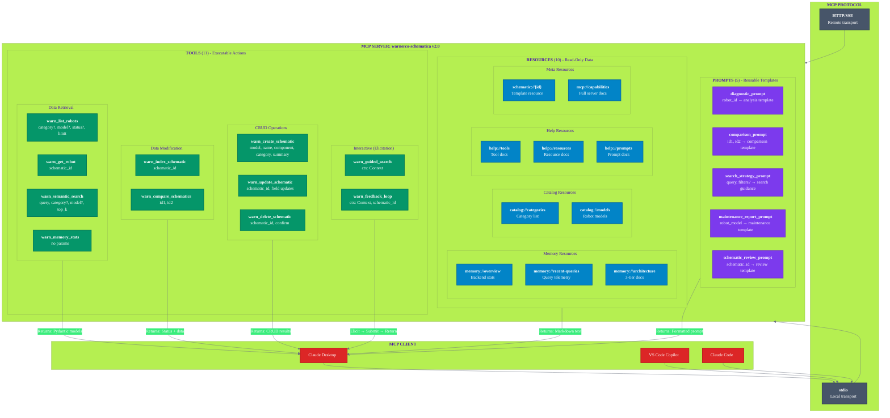

# WARNERCO Robotics Schematica - MCP Primitives



## MCP Primitives Reference

### Tools vs Resources vs Prompts

| Primitive | Purpose | Input | Output | Side Effects |
|-----------|---------|-------|--------|--------------|
| **Tool** | Execute actions | Parameters | Structured data | Yes (may modify state) |
| **Resource** | Read data | URI | Text/Markdown | No (read-only) |
| **Prompt** | Generate templates | Arguments | Formatted string | No (template only) |

### Tool Categories

#### Data Retrieval Tools
| Tool | Parameters | Returns |
|------|------------|---------|
| `warn_list_robots` | category?, model?, status?, limit | `SchematicListResult` |
| `warn_get_robot` | schematic_id | `SchematicDetail` |
| `warn_semantic_search` | query, category?, model?, top_k | `SemanticSearchResult` |
| `warn_memory_stats` | (none) | `MemoryStatsResult` |

#### Data Modification Tools
| Tool | Parameters | Returns |
|------|------------|---------|
| `warn_index_schematic` | schematic_id | `IndexResult` |
| `warn_compare_schematics` | id1, id2 | Comparison dict |

#### CRUD Tools
| Tool | Parameters | Returns |
|------|------------|---------|
| `warn_create_schematic` | model, name, component, category, summary, version?, status?, tags?, specifications?, url? | `CreateSchematicResult` |
| `warn_update_schematic` | schematic_id, model?, name?, component?, category?, summary?, version?, status?, tags?, specifications?, url? | `UpdateSchematicResult` |
| `warn_delete_schematic` | schematic_id, confirm | `DeleteSchematicResult` |

#### Interactive Tools (with Elicitation)
| Tool | Elicitation Flow | Returns |
|------|------------------|---------|
| `warn_guided_search` | Category → Model → Keywords | `GuidedSearchResult` |
| `warn_feedback_loop` | Rating + Comments form | `FeedbackResult` |

### Resource URI Schemes

| Scheme | Type | Description |
|--------|------|-------------|
| `memory://` | Static | Memory system information |
| `catalog://` | Static | Category and model catalogs |
| `help://` | Static | Self-documentation |
| `schematic://` | Template | Individual schematic documents |
| `mcp://` | Static | Server capabilities |

### Prompt Templates

| Prompt | Input | Output Purpose |
|--------|-------|----------------|
| `diagnostic_prompt` | robot_id | Guide diagnostic analysis |
| `comparison_prompt` | id1, id2 | Structure comparison review |
| `search_strategy_prompt` | query, filters? | Optimize search approach |
| `maintenance_report_prompt` | robot_model | Generate maintenance checklist |
| `schematic_review_prompt` | schematic_id | Technical review framework |

## Elicitation Pattern

```python
# Multi-step elicitation in warn_guided_search
@mcp.tool()
async def warn_guided_search(ctx: Context) -> GuidedSearchResult:
    # Step 1: Elicit category selection
    cat_result = await ctx.elicit(
        message="Select a category:",
        schema=CategorySelection
    )
    if cat_result.action != "submit":
        return cancelled_result()

    # Step 2: Elicit model selection
    model_result = await ctx.elicit(
        message="Select a robot model:",
        schema=ModelSelection
    )

    # Step 3: Elicit keywords
    kw_result = await ctx.elicit(
        message="Enter search keywords:",
        schema=KeywordInput
    )

    # Execute search with collected inputs
    return await execute_search(cat_result, model_result, kw_result)
```

## Pydantic Models

The server uses 17 Pydantic models for structured I/O:

**Output Models:**
- `SchematicSummary`, `SchematicListResult`, `SchematicDetail`
- `SearchResultItem`, `SemanticSearchResult`, `MemoryStatsResult`
- `ComparisonResult`, `IndexResult`, `GuidedSearchResult`, `FeedbackResult`
- `CreateSchematicResult`, `UpdateSchematicResult`, `DeleteSchematicResult`

**Elicitation Schemas:**
- `CategorySelection`, `ModelSelection`, `KeywordInput`, `FeedbackInput`
