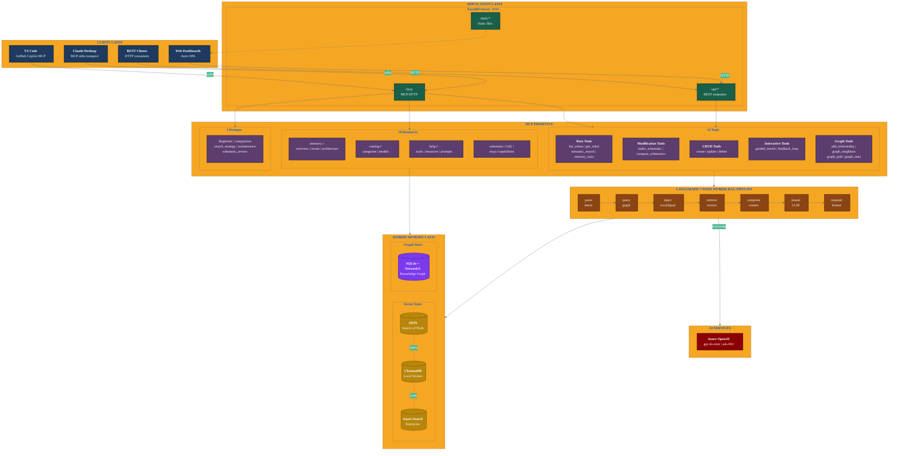

# WARNERCO Robotics Schematica - System Overview

## Architecture Summary

### Client Layer
- **Claude Desktop**: Native MCP stdio transport for desktop AI assistant
- **VS Code**: GitHub Copilot with MCP extension support
- **Web Dashboards**: Astro-built SPA served from /dash/
- **REST Clients**: Direct HTTP API access for integrations

### Application Layer
- **FastAPI Server**: Unified server on port 8000
  - `/api/*` - REST endpoints for programmatic access
  - `/mcp` - MCP HTTP endpoint for remote clients
  - `/dash/*` - Static file serving for dashboards

### MCP Primitives (v2.0)

| Primitive | Count | Purpose |
|-----------|-------|---------|
| **Tools** | 15 | Executable actions (CRUD, search, interactive, graph) |
| **Resources** | 10 | Read-only data (memory, catalog, help, meta) |
| **Prompts** | 5 | Reusable templates (diagnostic, comparison, etc.) |

### LangGraph Hybrid RAG Pipeline

7-node flow: `parse_intent` -> `query_graph` -> `inject_scratchpad` -> `retrieve` -> `compress_context` -> `reason` -> `respond`

The `query_graph` node enriches retrieval context with relationship data from the knowledge graph. The `inject_scratchpad` node adds session-scoped working memory observations.

### Hybrid Memory Layer

**Vector Store** (similarity search):
1. **JSON**: Zero-config, keyword search (development)
2. **ChromaDB**: Local vectors, semantic search (staging)
3. **Azure AI Search**: Enterprise hybrid search (production)

**Graph Store** (relationship queries):
- **SQLite + NetworkX**: Knowledge graph for entity relationships, dependency tracking, and path finding

See [Graph Memory Architecture](./graph-memory-architecture.md) for details.
