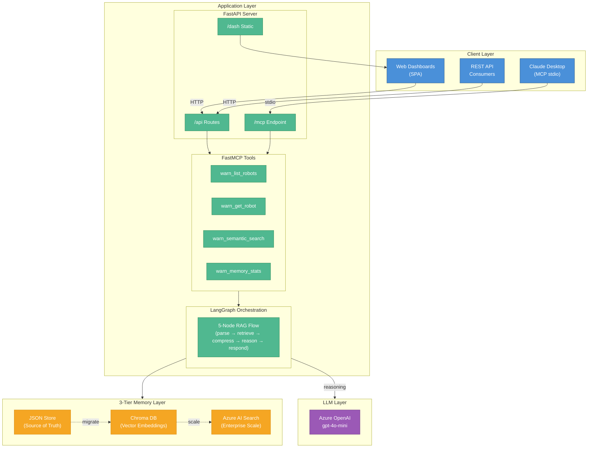

# WARNERCO Robotics Schematica - System Overview

## Description

This diagram shows the layered architecture of WARNERCO Robotics Schematica:

- **Client Layer**: Multiple access points including Claude Desktop (MCP stdio), web dashboards, and REST API consumers
- **Application Layer**: FastAPI server with mounted FastMCP tools and LangGraph orchestration
- **3-Tier Memory Layer**: Progressive memory backends from JSON (source of truth) to Chroma (vectors) to Azure AI Search (enterprise)
- **LLM Layer**: Azure OpenAI for reasoning capabilities
