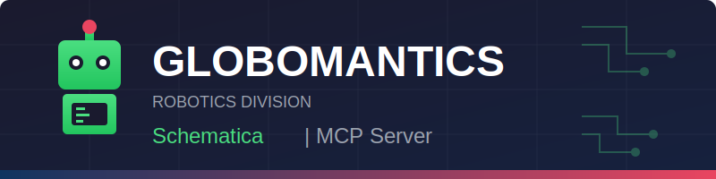

# Schematica - MCP Server for Robotic Schematics

**Advanced Component Documentation & Retrieval System**

Schematica is Globomantics Robotics' Model Context Protocol (MCP) server for intelligent schematic lookup and retrieval. Built for seamless integration with AI assistants, Schematica enables natural language queries across our complete robotics component database.

---

## Overview

Schematica serves as a production-ready MCP server demonstration designed for DevOps training and AI integration workflows. It exposes a comprehensive API for querying robotic component schematics from a synthetic database containing 250+ realistic entries across our entire product line.

**Key Use Cases:**
- AI-powered technical documentation retrieval
- Natural language component searches
- Integration with Claude Desktop and other MCP-compatible clients
- DevOps training for Docker, CircleCI, and Azure Container Apps

**Technology Stack:**
- **Backend:** Express.js with TypeScript
- **Authentication:** Bearer token (MCP_API_KEY)
- **Containerization:** Docker with multi-stage builds
- **CI/CD:** CircleCI with OIDC-based Azure deployment
- **Hosting:** Azure Container Apps

---

## Features

- **MCP-Compliant API** - Full implementation of the Model Context Protocol specification
- **Natural Language Queries** - Intuitive prompts like "Show me the cooling manifold schematic for XR-18"
- **250+ Synthetic Schematics** - Comprehensive database covering 7 component categories across 14 robot model series
- **Bearer Token Authentication** - Enterprise-grade security with environment-based API keys
- **Docker Support** - Production-optimized multi-stage builds for containerized deployment
- **Automated CI/CD** - Complete CircleCI pipeline with staging/production workflows
- **Azure Integration** - Native deployment to Azure Container Apps with OIDC authentication

---

## MCP Client Configuration

### Claude Desktop Setup

To use Schematica with Claude Desktop, you'll need to configure it in your MCP settings file.

**Location of config file:**
- **macOS:** `~/Library/Application Support/Claude/claude_desktop_config.json`
- **Windows:** `%APPDATA%\Claude\claude_desktop_config.json`

**Configuration:**

```json
{
  "mcpServers": {
    "schematica": {
      "url": "https://your-deployed-url.azurecontainerapps.io/api/mcp",
      "auth": {
        "type": "bearer",
        "token": "YOUR_API_KEY"
      }
    }
  }
}
```

**Setup Steps:**

1. **Deploy Schematica** to your Azure Container Apps instance (or run locally)
2. **Obtain your API key** from your deployment environment variables
3. **Open Claude Desktop settings**
   - Click the settings icon in the bottom-left
   - Navigate to the "Developer" tab
   - Click "Edit Config" to open the configuration file
4. **Add the Schematica server** configuration using the JSON above
5. **Replace placeholders:**
   - `your-deployed-url.azurecontainerapps.io` with your actual deployment URL
   - `YOUR_API_KEY` with your MCP_API_KEY value
6. **Save the file** and restart Claude Desktop
7. **Verify connection** - You should see "Schematica" listed in the MCP servers panel

### Other MCP Clients

Schematica is compatible with any MCP-compliant client. Refer to your client's documentation for configuration instructions. The server endpoint is always `/api/mcp` with Bearer authentication.

---

## Sample Prompts

Once configured in your MCP client, try these example prompts:

### Component Retrieval
- "Show me the cooling manifold schematic for XR-18"
- "Get the servo assembly docs for MK-9"
- "Find the LIDAR sensor documentation for GR robots"
- "What's the power distribution schematic for AX-7?"

### Category Browsing
- "List all thermal schematics"
- "Show me all motion components"
- "What power distribution schematics are available for the AX line?"
- "Find control system schematics"

### Model-Specific Queries
- "What motion components are available for the MK series?"
- "What structural components does the TX series have?"
- "Show me all active schematics for the VX-12"
- "List all sensors for DR model robots"

### Status Filtering
- "Show me deprecated schematics"
- "List all draft schematics in the thermal category"
- "What active manipulation components are available?"

---

## Quick Start

### Prerequisites

- Node.js 18 or higher
- npm or yarn
- Docker (optional, for containerized deployment)

### Local Development

```bash
# Clone the repository
git clone https://github.com/globomantics/schematica.git
cd schematica

# Install dependencies
npm install

# Set your API key
export MCP_API_KEY="your-secret-key"

# Run in development mode
npm run dev

# Or build and run production
npm run build
npm start
```

The server runs on `http://localhost:3000` by default.

**Testing the health endpoint:**
```bash
curl http://localhost:3000/health
```

---

## Environment Variables

| Variable | Required | Default | Description |
|----------|----------|---------|-------------|
| `MCP_API_KEY` | **Yes** | - | Bearer token for API authentication. Must be set for the server to start. |
| `PORT` | No | `3000` | Server port for HTTP connections |

**Security Note:** Never commit your `MCP_API_KEY` to version control. Use environment variables or secret management systems.

---

## API Reference

### Health Check

**Endpoint:** `GET /health`

**Authentication:** None required

**Description:** Returns server health status for monitoring and load balancer checks.

```bash
curl http://localhost:3000/health
```

**Response:**
```json
{
  "status": "healthy",
  "timestamp": "2025-12-10T14:23:45.123Z"
}
```

### MCP Endpoint

**Endpoint:** `POST /api/mcp`

**Authentication:** Bearer token required

**Description:** Main Model Context Protocol endpoint for all MCP operations.

#### List Available Tools

```bash
curl -X POST http://localhost:3000/api/mcp \
  -H "Authorization: Bearer your-api-key" \
  -H "Content-Type: application/json" \
  -d '{"method": "tools/list"}'
```

#### Call a Tool

```bash
curl -X POST http://localhost:3000/api/mcp \
  -H "Authorization: Bearer your-api-key" \
  -H "Content-Type: application/json" \
  -d '{
    "method": "tools/call",
    "params": {
      "name": "fetchSchematic",
      "arguments": {
        "query": "show me the cooling manifold schematic for XR-18"
      }
    }
  }'
```

---

## MCP Tools Available

### `fetchSchematic`

Retrieves detailed information for a specific robotic component schematic using natural language queries.

**Parameters:**
- `query` (string, required) - Natural language description of the schematic you're looking for
- `model` (string, optional) - Explicit model number to narrow search (e.g., "XR-18", "MK-9")
- `component` (string, optional) - Explicit component name to narrow search (e.g., "cooling manifold")

**Example:**
```json
{
  "name": "fetchSchematic",
  "arguments": {
    "query": "cooling manifold for XR-18"
  }
}
```

**Response:**
```json
{
  "content": [{
    "type": "text",
    "text": "{
      \"model\": \"XR-18\",
      \"component\": \"cooling manifold\",
      \"category\": \"thermal\",
      \"version\": \"v2.1\",
      \"status\": \"active\",
      \"summary\": \"Controls coolant flow to heat sinks on XR-18 units.\",
      \"url\": \"https://schematics.globomantics.io/xr-18/cooling_manifold_v2_1.pdf\",
      \"last_verified\": \"2025-11-28\"
    }"
  }]
}
```

### `listSchematics`

Lists available schematics with powerful filtering options across categories, models, and status.

**Parameters:**
- `category` (string, optional) - Filter by component category:
  - `thermal` - Cooling systems, heat management
  - `motion` - Motors, actuators, servos
  - `sensors` - LIDAR, cameras, proximity sensors
  - `power` - Batteries, power distribution
  - `control` - Controllers, processors, communication
  - `structural` - Chassis, mounting, housing
  - `manipulation` - Grippers, end effectors, manipulators
- `model` (string, optional) - Filter by model prefix (e.g., "XR", "MK", "GR")
- `status` (string, optional) - Filter by status: `active`, `deprecated`, `draft`
- `limit` (number, optional) - Maximum results to return (default: 50, max: 100)

**Example:**
```json
{
  "name": "listSchematics",
  "arguments": {
    "category": "thermal",
    "status": "active",
    "limit": 10
  }
}
```

**Response:**
```json
{
  "content": [{
    "type": "text",
    "text": "Found 8 schematics matching your criteria:\n\n1. XR-18 - cooling manifold (v2.1)\n2. MK-9 - heat sink assembly (v1.3)\n3. GR-14 - thermal regulator (v3.0)\n..."
  }]
}
```

---

## Docker

### Build the Image

```bash
docker build -t schematica:latest .
```

The Dockerfile uses a multi-stage build for optimal image size:
- Stage 1: Build TypeScript to JavaScript
- Stage 2: Production runtime with minimal dependencies

### Run the Container

```bash
docker run -d \
  -p 3000:3000 \
  -e MCP_API_KEY="your-secret-key" \
  --name schematica \
  schematica:latest
```

### Using Docker Compose

Create a `docker-compose.yml` file:

```yaml
version: '3.8'
services:
  schematica:
    build: .
    ports:
      - "3000:3000"
    environment:
      - MCP_API_KEY=${MCP_API_KEY}
    healthcheck:
      test: ["CMD", "wget", "--spider", "-q", "http://localhost:3000/health"]
      interval: 30s
      timeout: 3s
      retries: 3
    restart: unless-stopped
```

Run with:
```bash
docker-compose up -d
```

---

## Deployment

### Azure Container Apps

Schematica is designed for seamless deployment to Azure Container Apps with automated CI/CD via CircleCI.

**Quick Deploy:**
```bash
# Create Container Apps Environment
az containerapp env create \
  --name schematica-env \
  --resource-group $AZURE_RESOURCE_GROUP \
  --location eastus

# Create the Container App
az containerapp create \
  --name schematica \
  --resource-group $AZURE_RESOURCE_GROUP \
  --environment schematica-env \
  --image ghcr.io/globomantics/schematica:latest \
  --target-port 3000 \
  --ingress external \
  --secrets mcp-api-key=$MCP_API_KEY \
  --env-vars MCP_API_KEY=secretref:mcp-api-key
```

### CI/CD Pipeline

The project includes a complete CircleCI configuration at `.circleci/config.yml` implementing:

1. **Lint & Type Check** - Code quality validation
2. **Build Docker Image** - Multi-stage production builds
3. **Push to GHCR** - GitHub Container Registry publication
4. **Deploy to Staging** - Automated deployment with OIDC
5. **Manual Approval Gate** - Production deployment safeguard
6. **Deploy to Production** - Azure Container Apps update

**For detailed CircleCI and Azure setup instructions**, see our [CircleCI Deployment Guide](docs/circleci-setup.md).

---

## Project Structure

```
schematica/
├── .circleci/
│   └── config.yml              # CircleCI pipeline configuration
├── data/
│   └── schematics.json         # Synthetic schematic database (250 entries)
├── src/
│   ├── index.ts                # Express server & MCP endpoints
│   ├── auth.ts                 # Bearer token authentication
│   ├── schematic-service.ts    # Schematic lookup logic
│   └── types.ts                # TypeScript interfaces
├── scripts/
│   └── generate-schematics.ts  # Database generation script
├── Dockerfile                  # Multi-stage Docker build
├── mcp.json                    # MCP server metadata
├── package.json                # Node.js dependencies
├── tsconfig.json               # TypeScript configuration
├── globomantics-banner.png     # Company branding
└── README.md                   # This file
```

---

## Schematic Database

### Categories

| Category | Description | Example Components |
|----------|-------------|-------------------|
| **thermal** | Cooling systems, heat management | Cooling manifolds, heat sinks, thermal regulators |
| **motion** | Motors, actuators, servos | Servo assemblies, stepper motors, linear actuators |
| **sensors** | LIDAR, cameras, proximity sensors | LIDAR units, vision systems, proximity detectors |
| **power** | Batteries, power distribution | Battery packs, power regulators, distribution boards |
| **control** | Controllers, processors, communication | MCU boards, communication modules, processors |
| **structural** | Chassis, mounting, housing | Chassis frames, mounting brackets, protective housings |
| **manipulation** | Grippers, end effectors, manipulators | Gripper assemblies, end effectors, manipulator arms |

### Model Series

The database includes schematics across 14 robot model series:

**Industrial Series:** XR, MK, GR, RM, AX, TX
**Specialized Series:** VX, ZR, HX, DR
**Advanced Series:** SR, CX, NX, PX, QR

Each model series contains 15-20 component schematics spanning multiple categories.

---

## Development

### Running Tests

```bash
npm test
```

### Linting

```bash
npm run lint
```

### Type Checking

```bash
npm run type-check
```

### Building for Production

```bash
npm run build
```

The compiled JavaScript output is placed in the `dist/` directory.

---

## Troubleshooting

### Authentication Errors

**Problem:** `401 Unauthorized` responses

**Solution:** Verify your `MCP_API_KEY` environment variable is set and matches the token in your MCP client configuration.

### Connection Refused

**Problem:** Cannot connect to the server

**Solution:**
- Verify the server is running: `curl http://localhost:3000/health`
- Check the PORT environment variable
- Ensure no firewall is blocking the port

### No Results from Queries

**Problem:** `fetchSchematic` returns no results

**Solution:**
- Check your query syntax - use natural language like "cooling manifold for XR-18"
- Try a broader query or use `listSchematics` to explore available components
- Verify the component exists in the database for that model series

---

## License

MIT License

Copyright (c) 2025 Globomantics Robotics Company

Permission is hereby granted, free of charge, to any person obtaining a copy of this software and associated documentation files (the "Software"), to deal in the Software without restriction, including without limitation the rights to use, copy, modify, merge, publish, distribute, sublicense, and/or sell copies of the Software, and to permit persons to whom the Software is furnished to do so, subject to the following conditions:

The above copyright notice and this permission notice shall be included in all copies or substantial portions of the Software.

THE SOFTWARE IS PROVIDED "AS IS", WITHOUT WARRANTY OF ANY KIND, EXPRESS OR IMPLIED, INCLUDING BUT NOT LIMITED TO THE WARRANTIES OF MERCHANTABILITY, FITNESS FOR A PARTICULAR PURPOSE AND NONINFRINGEMENT. IN NO EVENT SHALL THE AUTHORS OR COPYRIGHT HOLDERS BE LIABLE FOR ANY CLAIM, DAMAGES OR OTHER LIABILITY, WHETHER IN AN ACTION OF CONTRACT, TORT OR OTHERWISE, ARISING FROM, OUT OF OR IN CONNECTION WITH THE SOFTWARE OR THE USE OR OTHER DEALINGS IN THE SOFTWARE.

---

## About Globomantics Robotics

Globomantics Robotics is a fictional company created for educational and training purposes. This project demonstrates best practices for building production-ready MCP servers with modern DevOps workflows, including:

- TypeScript development with Express.js
- Docker containerization strategies
- CI/CD automation with CircleCI
- Cloud deployment to Azure Container Apps
- OIDC-based authentication workflows
- Bearer token security implementation

**Training Focus:** DevOps engineers learning to implement complete CI/CD pipelines for containerized applications with cloud deployment automation.

---

## Contributing

This is a demonstration project for training purposes. For questions or issues, please contact the Globomantics DevOps training team.

---

## Support

For technical support or questions about Schematica:

- **Documentation:** See this README and inline code comments
- **Issues:** Review common troubleshooting scenarios above
- **Training:** Contact your DevOps training coordinator

---

**Built with precision by Globomantics Robotics** | *Powering the future of intelligent automation*
